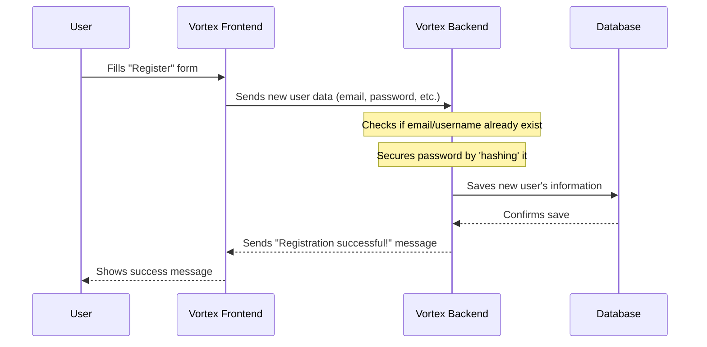
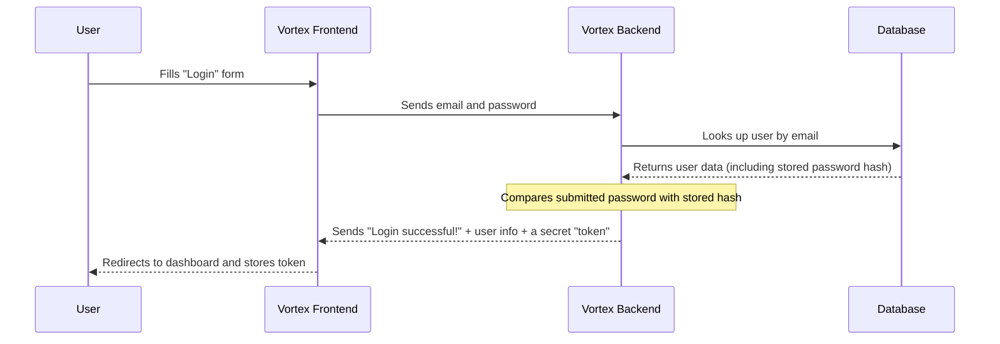

# Chapter 1: User Authentication & Management

Imagine you want to build your amazing new project, "My Awesome App", using Vortex. Before you can deploy it, you need to tell Vortex who you are! This is where **User Authentication & Management** comes in.

Think of it like entering a special building. You can't just walk in and start setting up your office. First, you need to prove your identity at the main entrance (authentication), and once inside, you might need special keys or permissions to access certain rooms (authorization). Later, if you want to change your address or contact details, you'd go to the administrative office (user management).

Vortex's User Authentication & Management system is exactly this: it's the security and administrative office rolled into one! It handles:

- **Checking your credentials** when you sign up or log in.
- **Managing your personal details** like your name or email.
- **Ensuring only you can access your projects** and deployments.

It's super important for keeping your account safe and making your experience with Vortex personalized.

---

### Your First Step: Signing Up and Logging In

The very first thing you'll do on Vortex is usually to create an account (register) or sign in if you already have one (login). This is our central use case for this chapter.

**How it works from your perspective:**

1.  **Visit Vortex:** You open the Vortex application in your web browser.
2.  **Choose Your Path:** You'll see options to either "Login" or "Register".
3.  **Provide Details:**
    - **If Registering:** You'll enter details like your full name, a unique username, your email address, a password, and your GitHub profile (which will be important for our next chapter, [GitHub Integration](02_github_integration_.md)!).
    - **If Logging In:** You'll just need your email and password.
4.  **Confirmation:** Vortex tells you if it worked! If you registered, you'll be prompted to log in. If you logged in, you'll be taken to your personal dashboard.

**Let's imagine you're a new user named Alice:**

- **Input (Register):**
  - Full Name: "Alice Wonderland"
  - Username: "alice_vortex"
  - Email: "alice@example.com"
  - Password: "MyStrongVortexPassword123!"
  - GitHub Profile: "alicegithub"
- **Output (Register):** A message saying, "Account created successfully! Please log in."

- **Input (Login):**
  - Email: "alice@example.com"
  - Password: "MyStrongVortexPassword123!"
- **Output (Login):** You are seamlessly redirected to your Vortex dashboard, ready to create projects!

---

### How Vortex Handles It (Under the Hood)

Let's peel back the layers and see what happens when you register or log in. It's like a conversation between different parts of Vortex.

Here's a simplified sequence of events for **User Registration**:



And for **User Login**:



---

### A Peek at the Code

Vortex's user authentication and management is handled by several components working together. Let's look at some key parts:

#### 1. The Frontend Pages (`Auth.jsx` & `AccountSettings.jsx`)

These are the parts you directly interact with in your browser. They collect your information and display messages.

**`frontend/src/pages/Auth.jsx` (Login/Register Form)**

This file contains the forms where you enter your email, password, etc. When you click "Login" or "Register", it sends your information to the Vortex Backend.

```javascript
// frontend/src/pages/Auth.jsx (Simplified)
// ...
import axios from "axios"; // Used to send data to the backend

const Auth = () => {
	// ... state for email, password, etc. ...

	// Function to handle logging in
	const handleLogin = async (e) => {
		e.preventDefault(); // Stop the page from reloading
		try {
			// Send user's email and password to the backend for verification
			const { data } = await axios.post("/api/auth/login", { email, password });
			// If successful, update our app's login status
			dispatch(loginSuccess({ token: data.token, user: data.user }));
			// ... redirect to home page ...
		} catch (err) {
			// ... show error message ...
		}
	};

	// Function to handle registering a new user
	const handleRegister = async (e) => {
		e.preventDefault();
		try {
			// Send new user's details to the backend to create an account
			const { data } = await axios.post("/api/auth/register", {
				fullname,
				username,
				email,
				password,
				githubProfile,
			});
			// ... show success message and prompt login ...
		} catch (err) {
			// ... show error message ...
		}
	};

	// ... form rendering (input fields, buttons) ...
};
```

_What this code does:_ It shows how the `Auth.jsx` page captures your input (like email and password) and sends it using `axios.post` to specific addresses (like `/api/auth/login`) on the backend. It's like filling out a physical form and mailing it to the administrative office.

**`frontend/src/pages/AccountSettings.jsx` (Managing Your Info)**

Once you're logged in, you might want to change your password or update your full name. This page lets you do that.

```javascript
// frontend/src/pages/AccountSettings.jsx (Simplified)
// ...
import axios from "axios"; // Again, for sending data

const AccountSettings = () => {
	// ... state for user data ...

	// Function to save changes to your account
	const handleSave = async () => {
		try {
			// Send updated details to the backend
			const res = await axios.put(
				`/api/user/updateuser/${username}`, // Send to a special address for updates
				{ fullname, email, password } // Only send changeable fields
			);
			// ... show success message ...
		} catch (err) {
			// ... show error message ...
		}
	};

	// ... fetching user details when page loads ...
	// ... input fields for updating data ...
};
```

_What this code does:_ This snippet shows how `AccountSettings.jsx` sends your updated information (`fullname`, `email`, `password`) to the backend using `axios.put`. The backend then processes these changes. It's like submitting a change-of-address form.

#### 2. The Frontend State (`UserSlice.js`)

In the frontend, we need to remember if you're logged in, who you are, and if something went wrong during login. We use a special tool called Redux for this, and the `UserSlice.js` file manages this "login state".

```javascript
// frontend/src/redux/user/UserSlice.js (Simplified)
import { createSlice } from "@reduxjs/toolkit";

const initialState = {
	user: null, // Stores user details if logged in
	token: null, // A secret key given after login
	loading: false, // True when login/logout is in progress
	error: null, // Any error messages
};

const userSlice = createSlice({
	name: "user",
	initialState,
	reducers: {
		loginStart: (state) => {
			state.loading = true;
			state.error = null;
		},
		loginSuccess: (state, action) => {
			// Called when login is successful
			state.loading = false;
			state.user = action.payload.user; // Store user details
			state.token = action.payload.token; // Store the secret token
			state.error = null;
		},
		loginFailure: (state, action) => {
			// Called if login fails
			state.loading = false;
			state.error = action.payload;
		},
		logoutSuccess: (state) => {
			// Called when logged out
			state.user = null;
			state.token = null;
			state.loading = false;
			state.error = null;
		},
	},
});

export const { loginStart, loginSuccess, loginFailure, logoutSuccess } =
	userSlice.actions;
export default userSlice.reducer;
```

_What this code does:_ This file defines how our application keeps track of your login status. For example, when `loginSuccess` is called, it means you've successfully logged in, and your `user` details and a `token` (a kind of digital ID card) are stored so the rest of the application knows who you are. If `loginFailure` is called, we know something went wrong.

#### 3. The Backend Routes (`auth.routes.js`)

These are like the addresses on the backend that your frontend requests are sent to. They direct traffic to the right "handlers".

```javascript
// backend/routes/auth.routes.js
import express from "express";
import { registerUser, loginUser } from "../controllers/auth.controller.js";

const router = express.Router();

router.post("/register", registerUser); // When frontend sends to /api/auth/register, use registerUser
router.post("/login", loginUser); // When frontend sends to /api/auth/login, use loginUser

export default router;
```

_What this code does:_ This sets up "post office boxes" for registration and login requests. When a request arrives at `/api/auth/register` (the `POST` method means it's sending data), it hands it over to the `registerUser` function.

#### 4. The Backend Controllers (`auth.controller.js` & `user.controller.js`)

These are the "workers" on the backend that actually process the requests. They do the heavy lifting of checking passwords, saving data, and talking to the database.

**`backend/controllers/auth.controller.js` (Login/Register Logic)**

```javascript
// backend/controllers/auth.controller.js (Simplified)
import bcrypt from "bcryptjs"; // For securing passwords
import jwt from "jsonwebtoken"; // For creating secret tokens
import User from "../models/user.model.js"; // Our user blueprint

// Handles new user registration
export const registerUser = async (req, res) => {
	const { username, fullname, password, githubProfile, email } = req.body;
	// ... check if fields are missing ...
	// ... check if email/username already exists ...

	const hashedPassword = await bcrypt.hash(password, 10); // Make password unreadable!

	const newUser = new User({
		username,
		fullname,
		password: hashedPassword,
		githubProfile,
		email,
	});
	await newUser.save(); // Save the new user to the database

	res.status(201).json({ message: "User registered successfully" });
};

// Handles user login
export const loginUser = async (req, res) => {
	const { email, password } = req.body;
	const user = await User.findOne({ email }); // Find user by email

	if (!user) {
		/* ... handle user not found ... */
	}

	const isMatch = await bcrypt.compare(password, user.password); // Compare passwords securely
	if (!isMatch) {
		/* ... handle wrong password ... */
	}

	const token = jwt.sign(
		// Create a secret token (digital ID card)
		{ id: user._id },
		process.env.JWT_SECRET,
		{ expiresIn: "7d" } // Token expires in 7 days
	);

	const { password: _, ...userData } = user._doc; // Remove password before sending
	res.status(200).json({ message: "Login successful", token, user: userData });
};
```

_What this code does:_ This is the core logic. For registration, it takes your plain text password and `hashes` it (turns it into a scrambled, unreadable code) before saving it. This makes it very secure! For login, it compares your entered password with the `hashed` password in the database. If they match, it creates a `token` – a special encrypted string that proves you're logged in without sending your password every time.

**`backend/controllers/user.controller.js` (User Profile Logic)**

```javascript
// backend/controllers/user.controller.js (Simplified)
import User from "../models/user.model.js";
import bcrypt from "bcryptjs";

// Fetches user details by username (without password)
export const getUserByUsername = async (req, res) => {
	const { username } = req.params;
	const user = await User.findOne({ username }).select("-password"); // Find user, but exclude password
	// ... handle user not found ...
	res.status(200).json(user);
};

// Updates user details
export const updateUser = async (req, res) => {
	const { username } = req.params;
	const { fullname, email, password } = req.body;

	const user = await User.findOne({ username });
	if (!user) return res.status(404).json({ message: "User not found" });

	if (fullname) user.fullname = fullname;
	if (email) user.email = email;
	if (password && password.trim() !== "") {
		const salt = await bcrypt.genSalt(10);
		user.password = await bcrypt.hash(password, salt); // Hash new password if provided
	}

	const updatedUser = await user.save(); // Save changes to the database
	// ... send back updated user details (without password) ...
};
```

_What this code does:_ This controller handles looking up user details (like when `AccountSettings.jsx` loads your profile) and updating them. Notice how if you update your password, it gets `hashed` again for security. It also makes sure your actual password never leaves the database in plain text.

#### 5. The Database Schema (`user.model.js`)

This file is like the blueprint for how user information is stored in the database. It defines what pieces of information a user has.

```javascript
// backend/models/user.model.js
import mongoose from "mongoose";

const userSchema = new mongoose.Schema(
	{
		username: { type: String, required: true, unique: true }, // Must be unique
		fullname: { type: String, required: true },
		email: { type: String, required: true, unique: true }, // Must be unique
		githubProfile: { type: String, required: true },
		password: { type: String }, // Stored as a hash, not plain text
	},
	{ timestamps: true } // Automatically adds 'createdAt' and 'updatedAt' fields
);

export default mongoose.model("User", userSchema);
```

_What this code does:_ This defines the structure of a "User" record in our database. It specifies that each user needs a `username`, `fullname`, `email`, `githubProfile`, and `password`. The `unique: true` part ensures no two users can have the same username or email, preventing conflicts. `timestamps: true` is a nice feature that automatically records when a user account was created and last updated.

---

### Conclusion

In this chapter, we've explored the crucial concept of **User Authentication & Management** in Vortex. You've learned how it acts as the security and administrative center, allowing you to securely create an account, log in, and manage your personal details. We've seen how the frontend interacts with the backend to achieve this, from filling out forms to securely storing and updating your information in the database.

Understanding this foundational chapter is key, as your user account is the gateway to all the powerful features Vortex offers. Next up, we'll dive into how Vortex connects with external services like GitHub to bring your projects to life.

[Next Chapter: GitHub Integration](02_github_integration_.md)

---

<sub><sup>**References**: [[1]](https://github.com/rohithr018/Vortex/blob/a4e90cde639281d2a87d34304364bab9c7af8969/backend/controllers/auth.controller.js), [[2]](https://github.com/rohithr018/Vortex/blob/a4e90cde639281d2a87d34304364bab9c7af8969/backend/controllers/user.controller.js), [[3]](https://github.com/rohithr018/Vortex/blob/a4e90cde639281d2a87d34304364bab9c7af8969/backend/models/user.model.js), [[4]](https://github.com/rohithr018/Vortex/blob/a4e90cde639281d2a87d34304364bab9c7af8969/backend/routes/auth.routes.js), [[5]](https://github.com/rohithr018/Vortex/blob/a4e90cde639281d2a87d34304364bab9c7af8969/frontend/src/pages/AccountSettings.jsx), [[6]](https://github.com/rohithr018/Vortex/blob/a4e90cde639281d2a87d34304364bab9c7af8969/frontend/src/pages/Auth.jsx), [[7]](https://github.com/rohithr018/Vortex/blob/a4e90cde639281d2a87d34304364bab9c7af8969/frontend/src/redux/user/UserSlice.js)</sup></sub>
