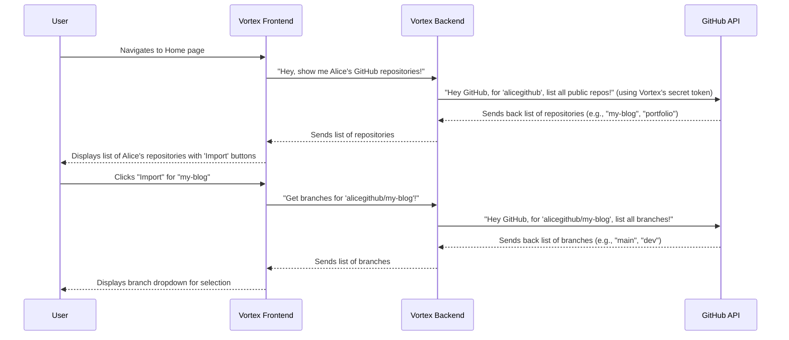

# Chapter 2: GitHub Integration

Welcome back! In [Chapter 1: User Authentication & Management](01_user_authentication___management_.md), we learned how Vortex identifies you and keeps your account safe. Now that Vortex knows _who_ you are, it needs to know _what_ you want to build! That's where **GitHub Integration** comes in.

Imagine GitHub as a giant digital library where you store all your amazing code projects. Vortex wants to help you build and deploy those projects, but it can't just magically see them. It needs a special connection, like a bridge, to your GitHub library.

This "GitHub Integration" feature is exactly that bridge! It lets Vortex talk directly to GitHub to find your code. This means you don't have to manually upload your project files to Vortex. Instead, you can simply pick a project directly from your GitHub profile, and Vortex will handle getting the code. It's super convenient!

---

### Your First Step: Finding Your Projects

The central use case for GitHub integration is to **easily select and import one of your GitHub projects for deployment**.

**How it works from your perspective:**

1.  **Log In to Vortex:** You've successfully logged into your Vortex account (thanks to [User Authentication & Management](01_user_authentication___management_.md)!).
2.  **Go to the Home/New Deployment Page:** This is usually the first page you see after logging in.
3.  **See Your Repositories:** Vortex will automatically show you a list of your GitHub repositories. It uses the GitHub username you provided when you registered (or linked later).
4.  **Select a Project:** You just click an "Import" button next to the project you want to deploy.
5.  **Choose a Branch:** On the next page, Vortex will show you all the different "branches" (versions) of your code in that project, and you pick the one you want to build.

It's like walking into your digital library, seeing all your books neatly organized, and just pointing to the one you want to start reading (or, in this case, building!).

**Let's imagine you're Alice again, and you have a project named "my-blog" on GitHub:**

- **Input (implicitly from Chapter 1):** Alice's Vortex account is linked to her GitHub profile "alicegithub".
- **Output (Home Page):** When Alice visits the Vortex Home page, she sees "alicegithub" displayed, and a list containing her "my-blog" repository, along with an "Import" button next to it.
- **Input (Click "Import"):** Alice clicks "Import" next to "my-blog".
- **Output (Deploy Page):** She is taken to a new page showing "alicegithub / my-blog" and a dropdown list of branches, like "main", "dev", etc.

---

### How Vortex Handles It (Under the Hood)

Let's see the behind-the-scenes magic that makes this happen. It involves your browser (the **Vortex Frontend**), the **Vortex Backend** (the "brain" of Vortex), and **GitHub's API** (GitHub's way of letting other programs talk to it).

Here's a simplified sequence of events when you try to import a project:



As you can see, Vortex Backend acts as a middleman, securely communicating with GitHub on your behalf using a special key (a "token") that allows it to access public information about your repositories.

---

### A Peek at the Code

Vortex uses a few key files to make this integration work:

#### 1. The Frontend Pages (`Home.jsx` & `Deploy.jsx`)

These are the pages you interact with directly in your browser.

**`frontend/src/pages/Home.jsx` (Listing Repositories)**

This file is responsible for showing you the list of your GitHub repositories after you log in. It sends a request to the backend to fetch them.

```javascript
// frontend/src/pages/Home.jsx (Simplified)
// ...
import { useSelector } from "react-redux";
import axios from "axios"; // Used to send data to the backend

const Home = () => {
	const [repositories, setRepositories] = useState([]);
	const { user } = useSelector((state) => state.user); // Get logged-in user's info
	const username = user?.githubProfile; // Extract GitHub profile name

	useEffect(() => {
		const fetchReposAndDeployments = async () => {
			if (!username) return; // Don't do anything if no GitHub profile is set
			try {
				// Send GitHub username to the backend to get repositories
				const reposResponse = await axios.post("/api/github/repos", {
					githubProfile: username,
				});
				setRepositories(reposResponse.data); // Store the received list of repos
			} catch (error) {
				console.error("Error fetching repositories:", error);
				// ... show error message ...
			}
		};
		fetchReposAndDeployments();
	}, [username]); // Re-run this effect if the username changes

	// ... code for filtering and displaying the repositories list ...
	// When an "Import" button is clicked, it navigates to the Deploy page
	const handleImportRepo = (repoName) => {
		navigate(`/deploy/${username}/${repoName}`);
	};
	// ... rest of the component ...
};
```

_What this code does:_ When the `Home` page loads, it checks your logged-in user's GitHub profile (`username`). It then uses `axios.post` to send this `username` to a specific address on the backend: `/api/github/repos`. Once the backend sends back the list of repositories, `setRepositories` updates the page, and the repositories appear on your screen. Clicking "Import" takes you to the `Deploy` page with your GitHub username and repository name in the address bar.

**`frontend/src/pages/Deploy.jsx` (Listing Branches)**

This page takes the selected repository and asks the backend for its branches, so you can choose which version of your code to deploy.

```javascript
// frontend/src/pages/Deploy.jsx (Simplified)
// ...
import axios from "axios";
import { useParams } from "react-router-dom"; // To get username and repo from URL

const Deploy = () => {
	const [branches, setBranches] = useState([]);
	const [selectedBranch, setSelectedBranch] = useState("");
	const { username, repo } = useParams(); // Get these from the URL (e.g., /deploy/alicegithub/my-blog)

	useEffect(() => {
		const fetchBranches = async () => {
			try {
				// Request branches for the specific owner and repository
				const response = await axios.get(
					`/api/github/branches/${username}/${repo}`
				);
				const branchList = response.data; // Get the list of branches
				if (branchList.length > 0) {
					setBranches(branchList);
					setSelectedBranch(branchList[0].name); // Select the first branch by default
				}
			} catch (error) {
				console.error("Error fetching branches:", error);
				// ... handle error ...
			} finally {
				// ... stop loading indicator ...
			}
		};
		fetchBranches();
	}, [username, repo]); // Re-run if username or repo changes in the URL

	// ... rest of the component for displaying branches dropdown and other deployment details ...
};
```

_What this code does:_ Once you land on the `Deploy` page, it extracts the `username` and `repo` name from the web address. It then makes another request using `axios.get` to `/api/github/branches/` with your `username` and `repo` name. The backend replies with the list of branches, which are then shown in a dropdown menu for you to select.

#### 2. The Backend Routes (`git.routes.js`)

These files act like the "front desk" of the backend, directing incoming requests to the correct "workers" (controllers).

```javascript
// backend/routes/git.routes.js
import express from "express";
import { getRepos, getRepoBranches } from "../controllers/git.controller.js";

const router = express.Router();

// When frontend sends data to /api/github/repos (POST request)
router.post("/repos", getRepos);
// When frontend asks for data from /api/github/branches/:owner/:repo (GET request)
router.get("/branches/:owner/:repo", getRepoBranches);

export default router;
```

_What this code does:_ This file tells Vortex's backend: "If someone sends a `POST` request to `/api/github/repos`, use the `getRepos` function. If someone sends a `GET` request to `/api/github/branches/` with an owner and repo name, use the `getRepoBranches` function."

#### 3. The Backend Controllers (`git.controller.js`)

These are the main "workers" on the backend. They actually do the job of talking to GitHub.

```javascript
// backend/controllers/git.controller.js (Simplified)
import { Octokit } from "@octokit/rest"; // A special library to talk to GitHub
import dotenv from "dotenv"; // To load secret keys
dotenv.config(); // Load environment variables (like GITHUB_TOKEN)

// Create an Octokit instance with our secret GitHub token
const octokit = new Octokit({
	auth: process.env.GITHUB_TOKEN, // This token allows Vortex to ask GitHub for information
});

// Function to fetch repositories for a user
export const getRepos = async (req, res) => {
	const { githubProfile } = req.body; // Get the GitHub profile name from the request

	try {
		// Ask GitHub's API to list repositories for that username
		const { data } = await octokit.repos.listForUser({
			username: githubProfile,
			per_page: 100, // Fetch up to 100 repositories
		});
		res.status(200).json(data); // Send the list of repositories back to the frontend
	} catch (error) {
		console.error("Error fetching GitHub repositories:", error.message);
		res
			.status(500)
			.json({ message: "Failed to fetch repositories from GitHub" });
	}
};

// Function to fetch branches for a specific repository
export const getRepoBranches = async (req, res) => {
	const { owner, repo } = req.params; // Get the owner and repo name from the request URL

	try {
		// Ask GitHub's API to list branches for that owner/repo combination
		const { data } = await octokit.repos.listBranches({
			owner,
			repo,
		});
		res.status(200).json(data); // Send the list of branches back to the frontend
	} catch (error) {
		console.error("Error fetching repository branches:", error.message);
		res.status(500).json({ message: "Failed to fetch branches" });
	}
};
```

_What this code does:_ This is the heart of the GitHub integration!

- It uses `Octokit`, a specialized tool, to make requests to GitHub.
- Crucially, it uses `process.env.GITHUB_TOKEN`. This is a _secret key_ that Vortex holds, which gives it permission to ask GitHub for public repository information (like names and branches). It's like a library card for GitHub!
- The `getRepos` function takes a `githubProfile` (your GitHub username) and asks GitHub to `listForUser` all the repositories associated with it.
- The `getRepoBranches` function takes an `owner` (your GitHub username) and a `repo` name, and asks GitHub to `listBranches` for that specific project.
- Finally, it sends the data it gets from GitHub back to the frontend, so you can see it in your browser.

---

### Conclusion

In this chapter, we've unlocked the power of **GitHub Integration** in Vortex. You've learned how Vortex acts as a bridge to your code stored on GitHub, automatically listing your repositories and their branches. This seamless connection means you can easily select your projects for deployment without any manual uploads, saving you time and effort. We also took a quick look at the code that makes this magic happen, from the frontend displaying your repos to the backend securely talking to GitHub.

Now that Vortex knows who you are and where to find your code, the next exciting step is to actually build and deploy that code!

[Next Chapter: Project Deployment Lifecycle](03_project_deployment_lifecycle.md)

---

<sub><sup>**References**: [[1]](https://github.com/rohithr018/Vortex/blob/a4e90cde639281d2a87d34304364bab9c7af8969/backend/controllers/git.controller.js), [[2]](https://github.com/rohithr018/Vortex/blob/a4e90cde639281d2a87d34304364bab9c7af8969/backend/middlewares/github.middleware.js), [[3]](https://github.com/rohithr018/Vortex/blob/a4e90cde639281d2a87d34304364bab9c7af8969/backend/routes/git.routes.js), [[4]](https://github.com/rohithr018/Vortex/blob/a4e90cde639281d2a87d34304364bab9c7af8969/frontend/src/pages/Deploy.jsx), [[5]](https://github.com/rohithr018/Vortex/blob/a4e90cde639281d2a87d34304364bab9c7af8969/frontend/src/pages/Home.jsx)</sup></sub>
