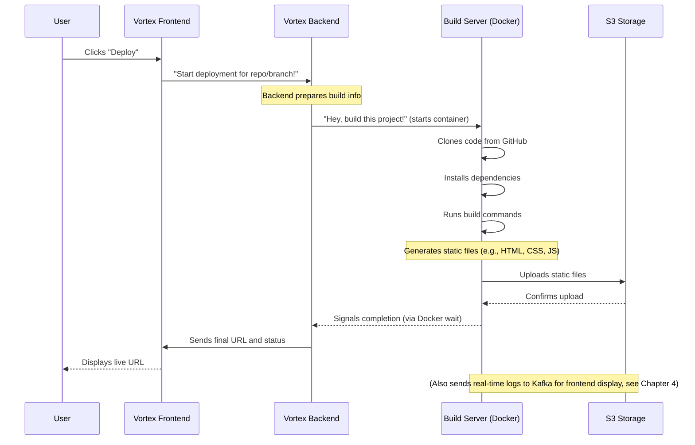

# Chapter 3: Project Deployment Lifecycle

Welcome back to Vortex! In [Chapter 1: User Authentication & Management](01_user_authentication___management_.md), we learned how Vortex knows who you are. Then, in [Chapter 2: GitHub Integration](02_github_integration_.md), we saw how Vortex finds your amazing code projects on GitHub. Now, it's time for the most exciting part: getting your code from GitHub to a live website for the world to see!

This entire journey, from picking your project to it being live online, is what we call the **Project Deployment Lifecycle**.

Imagine you've designed a fantastic new house (your code project!). You have the blueprints (your GitHub repository). Now, you need to build it and put it on a piece of land so people can visit it. Vortex's Project Deployment Lifecycle is like having an **automated construction crew** at your fingertips. You give it the blueprints, and it handles everything: fetching materials, building the structure, and even delivering the finished house to its live location!

---

### Your First Step: Deploying Your Project

The core idea of the Deployment Lifecycle is to **transform your raw code into a ready-to-use website accessible via a unique web address (URL)**.

**How it works from your perspective (the user):**

1.  **Select Your Project:** You've already done this in [Chapter 2: GitHub Integration](02_github_integration_.md) by navigating to the `Deploy` page for your chosen GitHub repository and branch.
2.  **Add Special Settings (Optional but Handy!):** Your project might need "secret ingredients" to run, like database passwords or API keys. These are called **Environment Variables**. You can easily add them on the `Deploy` page. Vortex keeps these safe and provides them to your project during the build.
3.  **Click "Deploy":** With a single click, you tell Vortex to start the construction!
4.  **Watch the Magic Happen:** As Vortex works, you'll see a stream of "build logs" – these are like real-time reports from your construction crew, telling you exactly what's happening (installing dependencies, building the code, uploading files).
5.  **Get Your Live URL:** Once the deployment is finished, Vortex gives you a special web address. You can click it, and voilà! Your project is live!

**Let's imagine Alice wants to deploy her "my-blog" project from GitHub:**

- **Input (from previous steps):** Alice is on the `Deploy` page for `alicegithub/my-blog`, with `main` branch selected.
- **Input (Optional):** Alice adds an environment variable: `API_KEY` with value `super-secret-key-123`.
- **Input:** Alice clicks the "Deploy" button.
- **Output:**
  - A stream of real-time build logs appears, showing steps like "Cloning Project...", "Installing dependencies...", "Build process started...", "Uploading files...".
  - Finally, a message like "Deployment completed successfully!" appears.
  - A "View Deployment" button appears, which links to `https://deployment-build-artifacts-bucket.s3.us-east-1.amazonaws.com/__outputs/alice-my-blog-main/index.html` (or a similar unique URL).

---

### The Automated Construction Crew: Key Steps

Vortex's deployment process can be broken down into these core steps, like an automated assembly line:

| Step                               | What it does                                                                                   | Analogy                                      |
| :--------------------------------- | :--------------------------------------------------------------------------------------------- | :------------------------------------------- |
| **1. Request Deployment**          | You tell Vortex to deploy a specific GitHub project and branch.                                | Giving blueprints to the foreman.            |
| **2. Provision Build Environment** | Vortex creates a temporary, isolated "workspace" (a Docker container).                         | Setting up a specialized construction site.  |
| **3. Clone Code**                  | Vortex fetches your project's code from GitHub into this workspace.                            | Getting the blueprints from the library.     |
| **4. Install Dependencies**        | It installs all the necessary tools and libraries your code needs to run.                      | Gathering all the right tools and materials. |
| **5. Build Project**               | It runs your project's build commands to turn your code into static files.                     | Actively building the house structure.       |
| **6. Upload Artifacts**            | It uploads the finished static files (the "built" website) to a storage service (like AWS S3). | Delivering the finished house to its plot.   |
| **7. Store Deployment Record**     | Vortex saves details about this deployment, including the live URL.                            | Filing away the completion certificate.      |
| **8. Stream Logs**                 | Throughout the process, Vortex sends real-time updates back to you.                            | The foreman sending live progress reports.   |

---

### How Vortex Handles It (Under the Hood)

Let's look at the simplified flow of how Vortex makes this happen.



As you can see, the **Vortex Backend** plays a central role, acting like the master orchestrator, telling a special "Build Server" (running inside a temporary Docker container) what to do. The Build Server then communicates with GitHub for code and with S3 for storing the final website files.

---

### A Peek at the Code

Let's dive into some simplified code snippets that make this deployment magic happen.

#### 1. The Frontend (`frontend/src/pages/Deploy.jsx`)

This is the page where you initiate the deployment. When you click "Deploy", it sends a request to the backend. It also constantly asks for new logs.

**`frontend/src/pages/Deploy.jsx` (Initiating Deployment)**

```javascript
// frontend/src/pages/Deploy.jsx (Simplified handleDeploy function)
// ... other imports and state ...

const handleDeploy = async () => {
	setIsDeploying(true); // Show a "deploying" status
	setLogs([]); // Clear previous logs

	const deploymentId = `${username}-${repo}-${selectedBranch}`;
	setDeploymentId(deploymentId); // Store this unique ID

	try {
		// 1. Tell the backend to start the build process
		await axios.post("/api/deploy/start", {
			repo,
			branch: selectedBranch,
			username,
			deploymentId,
			envVars: envVars, // Send environment variables
		});

		// 2. Start continuously asking for build logs (more in Chapter 4)
		pollLogs();
	} catch (error) {
		console.error("Deployment initiation failed:", error);
		// ... show error to user ...
		setIsDeploying(false);
	}
};

// ... JSX for buttons, input fields, and log display ...
```

_What this code does:_ This `handleDeploy` function is called when you click the "Deploy" button. It first sets some status variables, then sends a `POST` request to the `/api/deploy/start` address on the backend. This request includes all the necessary information for the deployment, like your repository name, chosen branch, GitHub username, a unique `deploymentId`, and any environment variables you've added. After starting the deployment, it then begins `pollLogs()`, which fetches real-time logs (we'll cover that in detail in [Chapter 4: Real-time Build Log Pipeline](04_real_time_build_log_pipeline_.md)).

#### 2. The Backend Routes (`backend/routes/deploy.route.js`)

These are the backend "addresses" that receive your deployment requests.

**`backend/routes/deploy.route.js` (Deployment Routes)**

```javascript
// backend/routes/deploy.route.js
import express from "express";
import {
	deployProject,
	createDeployment,
} from "../controllers/deploy.controller.js";

const router = express.Router();

// This route starts the actual build process
router.post("/start", deployProject);

// This route is called when the build is finished to save its record
router.post("/create", createDeployment);

export default router;
```

_What this code does:_ This file defines two main paths for deployment. When the frontend sends a `POST` request to `/api/deploy/start`, it's handled by the `deployProject` function. After the build is complete, the `createDeployment` function saves the final details to the database.

#### 3. The Backend Controller (`backend/controllers/deploy.controller.js`)

This is where the backend brain acts on your request and starts the "construction crew."

**`backend/controllers/deploy.controller.js` (Starting the Build Server)**

```javascript
// backend/controllers/deploy.controller.js (Simplified)
import { execSync } from "child_process"; // Used to run system commands (like Docker)
import Deployment from "../models/deployment.model.js"; // To save deployment records

export const deployProject = async (req, res) => {
	const { repo, branch, username, deploymentId, envVars } = req.body;
	// ... basic validation for missing fields ...

	const kafkaBroker = "kafka-broker:19092"; // Address for our logging system
	const containerName = `${deploymentId}`; // Unique name for our build worker

	// Clean up any old build workers with the same name
	try {
		execSync(`docker rm -f ${containerName}`);
	} catch {
		/* ignore error if not found */
	}

	// This is the core command! It starts a special Docker container
	const dockerRunCommand = [
		`docker run -d`, // Run in detached mode (background)
		`--name ${containerName}`, // Give it a unique name
		`--network deployment`, // Connect it to our internal network
		`-e REPO=${repo}`,
		`-e BRANCH=${branch}`,
		`-e USERNAME=${username}`, // Pass project info
		`-e DEPLOYMENT_ID=${deploymentId}`, // Pass unique deployment ID
		`-e KAFKA_BROKER=${kafkaBroker}`, // Tell it where to send logs
		`-e ENV='${JSON.stringify(envVars)}'`, // Pass environment variables
		"rohith1809/build-server-image:latest", // This is our pre-built "construction crew" image
	].join(" ");

	const containerId = execSync(dockerRunCommand).toString().trim(); // Run the command!
	res
		.status(200)
		.json({ message: "Deployment started", deploymentId: deploymentId });

	// The backend also "waits" for this container to finish its job
	// (Actual waiting logic is a bit more complex, but this shows the idea)
	// exec(`docker wait ${containerName}`, (err, stdout) => { ... });
};

export const createDeployment = async (req, res) => {
	const { deploymentId, repoName, branch, username, logs, url } = req.body;
	// ... validation ...

	const newDeployment = new Deployment({
		// Create a new record in the database
		deploymentId,
		repoName,
		branch,
		username,
		logs,
		url,
	});
	await newDeployment.save(); // Save it!

	res.status(201).json({
		message: "Deployment created successfully",
		deployment: newDeployment,
	});
};
```

_What this code does:_ The `deployProject` function is extremely important. It uses `execSync` to run a `docker run` command. This command starts a **new Docker container** specifically for _your_ deployment. Think of it as sending a new, highly specialized worker to a temporary construction site. This worker container is given all the details it needs (repo, branch, etc.) as "environment variables" so it knows what to build. The `createDeployment` function then saves the final deployment URL and details into Vortex's database.

#### 4. The Build Server (Inside the Docker Container)

This is the actual "construction crew" that does the heavy lifting. It's built from a `Dockerfile` and runs a `main.sh` script, which then executes a `script.js` file.

**`build-server/Dockerfile` (The "Construction Crew" Blueprint)**

```dockerfile
# build-server/Dockerfile (Simplified)
FROM ubuntu:focal # Start with a basic Linux system

RUN apt-get update && \
    apt-get install -y curl git openjdk-11-jdk maven jq && \
    curl -sL https://deb.nodesource.com/setup_20.x | bash - && \
    apt-get install -y nodejs && \
    apt-get upgrade -y # Install necessary tools: Git, Java, Maven, Node.js, jq

WORKDIR /home/app # Set the working directory inside the container

COPY main.sh main.sh # Copy our main script
COPY script.js script.js # Copy our build logic script
# ... other files ...

ENTRYPOINT ["/home/app/main.sh"] # This is the first thing run when the container starts
```

_What this code does:_ This file is the recipe for creating the "build server image." It starts with a clean Ubuntu Linux system and then installs all the software necessary to clone code (Git), build different types of projects (Node.js, Java, Maven), and process data (`jq`). Finally, it sets `main.sh` as the script to run when the container starts.

**`build-server/main.sh` (The Foreman's Initial Instructions)**

```bash
#!/bin/bash
# build-server/main.sh (Simplified)

set -e # Exit immediately if any command fails

# Get project details from environment variables passed by the backend
REPO="${REPO}"
BRANCH="${BRANCH}"
USERNAME="${USERNAME}"
ENV_VARS="${ENV}" # Your environment variables for the project

GIT_REPOSITORY_URL="https://github.com/${USERNAME}/${REPO}.git"

# 1. Clone the project from GitHub
git clone "$GIT_REPOSITORY_URL" > /dev/null 2>&1
cd "$REPO" # Go into the cloned project folder
git checkout "$BRANCH" > /dev/null 2>&1 # Switch to the correct branch

# 2. If environment variables were provided, save them to a .env file
if [ -n "$ENV_VARS" ]; then
  echo "$ENV_VARS" | jq -r '.[] | "\(.key)=\(.value)"' > ".env"
  export $(grep -v '^#' ".env" | xargs) # Load them for build
fi

cd ../ && npm install > /dev/null 2>&1 # Install npm dependencies for script.js
node script.js > /dev/null 2>&1 # Run the main build logic
```

_What this code does:_ This `main.sh` script is the first thing the build container executes. It receives all the project information (repo, branch, environment variables) as special settings. It then uses `git clone` to get your project's code, switches to the correct `branch`, and crucially, sets up any provided environment variables. Finally, it executes `script.js`, which contains the detailed build logic.

**`build-server/script.js` (The Detailed Construction Plan)**

This is the brains of the build server, handling the actual building and uploading.

- **Detecting Build Strategy:** Your project might be a Node.js app, a Java app, or just a static HTML website. This function figures out the best way to build it.

  ```javascript
  // build-server/script.js (Simplified: detectBuildStrategy)
  function detectBuildStrategy(projectPath) {
  	const hasPackageJson = fs.existsSync(
  		path.join(projectPath, "package.json")
  	);
  	const hasPom = fs.existsSync(path.join(projectPath, "pom.xml"));

  	if (hasPom) return "java-maven"; // Example: Java project
  	if (hasPackageJson) {
  		const pkg = JSON.parse(
  			fs.readFileSync(path.join(projectPath, "package.json"), "utf-8")
  		);
  		const scripts = pkg.scripts || {};
  		if (scripts["build"]) {
  			if (fs.existsSync(path.join(projectPath, "next.config.js")))
  				return "nextjs"; // Example: Next.js project
  			return "node"; // Example: General Node.js project
  		}
  	}
  	return "static"; // Default for simple HTML/CSS
  }
  ```

  _What this code does:_ This function looks for specific files in your project (like `package.json` for Node.js projects, or `pom.xml` for Java Maven projects) to guess what kind of project it is. This helps Vortex pick the right build commands.

- **Getting Build Command:** Once the strategy is known, this function provides the right commands.

  ```javascript
  // build-server/script.js (Simplified: getBuildCommand)
  function getBuildCommand(strategy, projectPath) {
  	if (["nextjs", "vite", "node"].includes(strategy)) {
  		return "npm install && npm run build"; // For Node.js projects
  	}
  	if (strategy === "java-maven") return "mvn clean install"; // For Java Maven
  	return ""; // No build command for static sites, just upload
  }
  ```

  _What this code does:_ Based on the detected `strategy`, this function returns the actual command Vortex needs to run inside your project folder. For example, a Node.js project will typically run `npm install` (to get all its libraries) and then `npm run build` (to create the final website files).

- **Running the Build Process:** This is where the command actually executes.

  ```javascript
  // build-server/script.js (Simplified: core build execution)
  // ... (inside the init() function) ...

  const projectPath = `/home/app/${REPO}`;
  const strategy = detectBuildStrategy(projectPath);
  await publishLog(`Detected build strategy: ${strategy}`, "INFO");

  const buildCommand = getBuildCommand(strategy, projectPath);
  await publishLog(`Running build command: ${buildCommand}`, "INFO");

  // This command executes your project's build process!
  const p = exec(`cd ${projectPath} && ${buildCommand}`);

  // Capture logs from your build process and send them back to Vortex
  p.stdout.on("data", async (data) => {
  	await publishLog(`${data.toString()}`, "INFO");
  });
  p.stderr?.on("data", async (data) => {
  	await publishLog(`${data.toString()}`, "ERROR");
  });

  p.on("close", async (code) => {
  	await publishLog(`Build process exited with code ${code}`, "INFO");
  	// ... (Next step: find build output folder and upload) ...
  });
  ```

  _What this code does:_ The `exec` function runs the `buildCommand` (like `npm install && npm run build`). As your project builds, any messages it prints (both regular messages and errors) are captured and sent as logs back to Vortex (using `publishLog`), which then appears on your screen!

- **Uploading to S3:** After the build, the final website files are uploaded.

  ```javascript
  // build-server/script.js (Simplified: uploadFileToS3 & uploadFolderToS3)
  import { S3Client, PutObjectCommand } from "@aws-sdk/client-s3"; // AWS S3 library
  import mime from "mime-types"; // To guess file types

  const s3Client = new S3Client({
  	/* ... AWS credentials ... */
  }); // Connect to S3

  async function uploadFileToS3(filePath, folderToUpload) {
  	const key = `__outputs/${DEPLOYMENT_ID}/${path.relative(
  		folderToUpload,
  		filePath
  	)}`;

  	const command = new PutObjectCommand({
  		Bucket: process.env.S3_BUCKET, // The S3 bucket name
  		Key: key, // The path where the file will be stored in S3
  		Body: fs.createReadStream(filePath), // The file content
  		ContentType: mime.lookup(filePath) || "application/octet-stream", // File type
  	});
  	await s3Client.send(command); // Send the file to S3!
  	return { success: true };
  }

  async function uploadFolderToS3(folderToUpload) {
  	// ... Logic to find all files in the build output folder (e.g., 'dist' or 'build') ...
  	// For each file, call uploadFileToS3
  	await publishLog(`Uploading all files to S3...`, "INFO");
  	const uploadResults = await Promise.all(
  		allFiles.map((filePath) => uploadFileToS3(filePath, folderToUpload))
  	);
  	// ... Check for failures ...
  	return true; // Return success/failure
  }
  ```

  _What this code does:_ After the build commands finish, `script.js` identifies the output folder (usually `dist`, `build`, or `target`). It then uses the `S3Client` to `PutObjectCommand` and upload _every single file_ from that output folder to an Amazon S3 storage bucket. Each file gets a unique path (a `Key`) that includes your `DEPLOYMENT_ID`. This makes your website publicly accessible!

#### 5. Services Configuration (`services/docker-compose.yml`)

While you don't directly interact with this file for deployment, it's how Vortex sets up its internal services, including the **`application`** (Vortex's backend) and other supporting services like Kafka and S3 client.

**`services/docker-compose.yml` (Relevant Snippet)**

```yaml
# services/docker-compose.yml (Simplified, focusing on relevant parts)
version: "3.8"

services:
  # ... kafka-controller, kafka-broker, topic-init, console, clickhouse ...
  # (These support logging, monitoring, and data storage, covered in other chapters)

  application: # This is the Vortex backend service
    image: rohith1809/vortex:latest
    container_name: vortex-app
    depends_on:
      kafka-broker:
        condition: service_healthy
      clickhouse:
        condition: service_started
    ports:
      - "3000:3000" # Frontend port
      - "5000:5000" # Backend API port
    volumes:
      - /var/run/docker.sock:/var/run/docker.sock # KEY PART: Allows Vortex to run Docker commands
    networks:
      - deployment
    restart: unless-stopped
    environment:
      - DOCKER_HOST=unix:///var/run/docker.sock # Tell backend how to talk to Docker
# ... volumes and networks ...
```

_What this code does:_ The most crucial line here for deployment is `- /var/run/docker.sock:/var/run/docker.sock` under the `application` service. This is like giving the Vortex backend a direct control panel to your computer's Docker engine. It allows the `execSync` commands (like `docker run`) in `deploy.controller.js` to actually start new build containers!

---

### Conclusion

In this chapter, we've taken a deep dive into the **Project Deployment Lifecycle** in Vortex. You've learned how your code goes from GitHub blueprints to a live, accessible website through an automated, multi-step process involving code cloning, dependency installation, project building, and finally, uploading to cloud storage. We peeled back the layers to see how the frontend kicks off the process, how the backend orchestrates the temporary "build server" (a Docker container), and how this build server uses clever scripts to transform your code and publish it online.

Understanding this automated "construction crew" is essential, as it's the core engine that brings your projects to life. Next up, we'll explore how Vortex keeps you fully informed throughout this entire process with **Real-time Build Log Pipeline**!

[Next Chapter: Real-time Build Log Pipeline](04_real_time_build_log_pipeline_.md)

---

<sub><sup>**References**: [[1]](https://github.com/rohithr018/Vortex/blob/a4e90cde639281d2a87d34304364bab9c7af8969/backend/controllers/deploy.controller.js), [[2]](https://github.com/rohithr018/Vortex/blob/a4e90cde639281d2a87d34304364bab9c7af8969/backend/routes/deploy.route.js), [[3]](https://github.com/rohithr018/Vortex/blob/a4e90cde639281d2a87d34304364bab9c7af8969/build-server/Dockerfile), [[4]](https://github.com/rohithr018/Vortex/blob/a4e90cde639281d2a87d34304364bab9c7af8969/build-server/main.sh), [[5]](https://github.com/rohithr018/Vortex/blob/a4e90cde639281d2a87d34304364bab9c7af8969/build-server/script.js), [[6]](https://github.com/rohithr018/Vortex/blob/a4e90cde639281d2a87d34304364bab9c7af8969/frontend/src/pages/Deploy.jsx), [[7]](https://github.com/rohithr018/Vortex/blob/a4e90cde639281d2a87d34304364bab9c7af8969/services/docker-compose.yml)</sup></sub>
