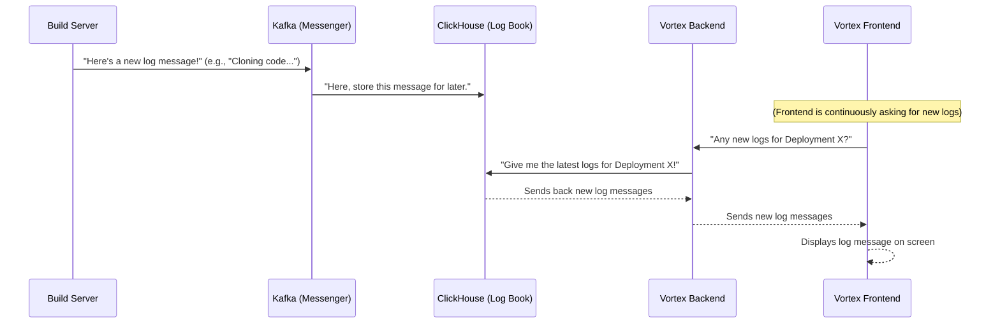

# Chapter 4: Real-time Build Log Pipeline

Welcome back, fellow Vortex user! In our last chapter, [Chapter 3: Project Deployment Lifecycle](03_project_deployment_lifecycle.md), we learned how Vortex takes your code from GitHub and turns it into a live website. You clicked "Deploy," and magic happened behind the scenes.

But how do you _know_ what's happening during that magic? Is your project installing packages? Is it compiling code? Did something go wrong? This is where the **Real-time Build Log Pipeline** comes in!

Imagine you're watching a live stream of your project being built. Every hammer swing, every nail hammered, every piece of wood cut – you see it all happening instantly. Vortex's Real-time Build Log Pipeline is exactly this: it's a **live activity feed** for your project's deployment. As the "construction" happens, every action and message from the build process is immediately sent through a high-speed messenger to a specialized log book. This ensures that your screen can display real-time updates, and you can quickly review the entire build history later.

---

### Your First Step: Watching Your Project Build Live

The central idea of the Real-time Build Log Pipeline is to **provide instant visibility into the deployment process.** You want to see the progress and any potential issues as they occur, not wait until the very end.

**How it works from your perspective:**

1.  **Initiate Deployment:** You've just clicked the "Deploy" button for your project on the Vortex `Deploy` page (just like in [Chapter 3](03_project_deployment_lifecycle.md)).
2.  **Watch the Log Stream:** Immediately, a section on the page lights up, and lines of text start appearing. These are your real-time build logs!
3.  **Monitor Progress:** You see messages like "Cloning Project...", "Installing dependencies...", "Build completed...", and "Uploading files...". If an error occurs, you see it instantly in red.
4.  **Review History:** Even after the deployment finishes, you can revisit the deployment page later, and the full history of these logs will still be available for review.

**Let's imagine Alice deploys her "my-blog" project again:**

- **Input:** Alice is on the `Deploy` page for `alicegithub/my-blog` and clicks "Deploy."
- **Output:** The page dynamically updates, and a scrollable area fills with messages:
  ```
  [INFO] Deployment process started...
  [INFO] Deployment ID: alice-my-blog-main-202310261030
  [INFO] Cloning Project Into /home/app/my-blog...
  [INFO] Checking out to main
  [INFO] Build process started...
  [INFO] Detected build strategy: node
  [INFO] Installing dependencies and preparing build...
  [INFO] Running build command: npm install && npm run build
  ... (many lines from npm install and build) ...
  [INFO] Build process exited with code 0
  [INFO] Found "dist" folder. Using it as deployment output.
  [INFO] Uploading all files to S3...
  [INFO] Uploaded 50/50 files
  [INFO] Cleaned up local build folder: /home/app/my-blog/dist
  [INFO] Deployment completed successfully!
  ```
  If there was an error, she might see:
  ```
  ...
  [ERROR] npm ERR! code ELIFECYCLE
  [ERROR] npm ERR! my-blog@1.0.0 build: `react-scripts build`
  [ERROR] npm ERR! Exit status 1
  ...
  [ERROR] Deployment failed due to build errors
  ```

---

### The Real-time Log Superhighway: Key Concepts

To make this "live activity feed" work, Vortex uses a specialized setup. Think of it like a highly efficient communication system.

| Component        | Analogy                                                  | What it does in Vortex                                                                                   |
| :--------------- | :------------------------------------------------------- | :------------------------------------------------------------------------------------------------------- |
| **Kafka**        | The "High-Speed Messenger Service" (a conveyor belt)     | Instantly takes log messages from the build server and makes them available to others.                   |
| **ClickHouse**   | The "Super-Fast Log Book" (a specialized filing cabinet) | Stores all the log messages from Kafka in an organized way, optimized for quick searching and retrieval. |
| **Log Pipeline** | The "Communication Superhighway"                         | The entire path that log messages travel, from creation to display and storage.                          |

---

### How Vortex Handles It (Under the Hood)

Let's see the journey a single log message takes from the build server to your screen.



Here's what happens in simple terms:

1.  **Build Server Sends:** As your project builds inside the Docker container ([from Chapter 3](03_project_deployment_lifecycle.md)), every step (like `git clone`, `npm install`, `npm run build`) generates messages. The `build-server/script.js` directly sends these messages to **Kafka**.
2.  **Kafka Routes:** Kafka acts like a central hub. It receives these messages and quickly delivers them to anyone who is "listening" for them. One of its listeners is **ClickHouse**.
3.  **ClickHouse Stores:** ClickHouse is designed to store vast amounts of data very quickly and efficiently. It takes the messages from Kafka and stores them, making them immediately available for queries.
4.  **Frontend Asks (Polls):** Your Vortex frontend (the web page you see) doesn't passively _receive_ logs. Instead, it regularly _asks_ the Vortex Backend: "Hey, are there any new logs for my deployment?" This is called "polling."
5.  **Backend Retrieves:** The Vortex Backend, when asked, queries **ClickHouse** for all the logs related to your specific `deploymentId`.
6.  **Backend Sends & Frontend Displays:** The backend sends these retrieved logs to the frontend, which then updates the display, showing you the new messages in real-time.

---

### A Peek at the Code

Let's see the key pieces of code that bring this log pipeline to life.

#### 1. The Build Server (`build-server/script.js`) - Sending Logs

This is where logs are _generated_ and _sent_ into the pipeline. Recall `script.js` from [Chapter 3](03_project_deployment_lifecycle.md) where it handled the build process. It also contains logic to send logs.

```javascript
// build-server/script.js (Simplified for log sending)
import { Kafka } from "kafkajs"; // Library to talk to Kafka
import dotenv from "dotenv";
dotenv.config();

const DEPLOYMENT_ID = process.env.DEPLOYMENT_ID;
const KAFKA_BROKER = process.env.KAFKA_BROKER; // Address of Kafka
const KAFKA_TOPIC = "build-logs"; // The name of our log channel

const kafka = new Kafka({
	clientId: "deployment",
	brokers: [KAFKA_BROKER], // Connect to our Kafka messenger
});

const producer = kafka.producer(); // We'll use this to send messages

// Function to send a log message to Kafka
async function publishLog(logMessage, logLevel = "INFO") {
	try {
		await producer.send({
			topic: KAFKA_TOPIC, // Send to the 'build-logs' channel
			messages: [
				{
					key: "log",
					value: JSON.stringify({
						// Format the message as JSON
						deployment_id: DEPLOYMENT_ID,
						log_message: logMessage,
						log_level: logLevel,
					}),
				},
			],
		});
	} catch (error) {
		console.error("Error publishing log:", error);
	}
}

// ... (Inside the init() function where build commands run) ...
// Example: Capturing output and sending it as a log
p.stdout.on("data", async (data) => {
	await publishLog(data.toString(), "INFO"); // Send standard output as INFO logs
});
p.stderr?.on("data", async (data) => {
	await publishLog(data.toString(), "ERROR"); // Send errors as ERROR logs
});

// ... (Rest of the build logic from Chapter 3) ...
```

_What this code does:_ This snippet shows the `publishLog` function. Whenever the `build-server/script.js` wants to send an update (like "Cloning Project..." or an error), it calls `publishLog`. This function then uses the `kafkajs` library to send a structured message (including `deployment_id`, the actual message, and its `log_level`) to our Kafka `build-logs` topic. This is how messages start their journey down the superhighway.

#### 2. Services Setup (`services/docker-compose.yml` & `services/create-topic.sh`) - The Infrastructure

These files define and set up Kafka and ClickHouse, the core components of our log pipeline.

**`services/docker-compose.yml` (Kafka & ClickHouse services - Simplified)**

```yaml
# services/docker-compose.yml (Simplified for Log Pipeline)
version: "3.8"

services:
  # ... kafka-controller service ...

  kafka-broker: # Our high-speed messenger service
    image: apache/kafka:3.8.1
    container_name: kafka-broker
    ports:
      - "29092:9092" # External access for host machine
    environment:
      KAFKA_ADVERTISED_LISTENERS: "PLAINTEXT://kafka-broker:19092,PLAINTEXT_HOST://localhost:29092"
      # ... other Kafka settings ...
    healthcheck: # Checks if Kafka is ready to receive messages
      test: ["CMD-SHELL", "bash -c 'echo > /dev/tcp/localhost/19092'"]
      # ...
    networks:
      - deployment # Connects to our internal network

  topic-init: # Ensures our 'build-logs' channel exists in Kafka
    image: apache/kafka:3.8.1
    container_name: kafka-topic-init
    depends_on:
      kafka-broker:
        condition: service_healthy # Waits for Kafka to be ready
    volumes:
      - ./create-topic.sh:/create-topic.sh:ro # Our script to create the topic
    entrypoint: ["/bin/bash", "/create-topic.sh"]
    command: ["build-logs"] # The topic name we want to create
    networks:
      - deployment
    restart: "no" # Only run once

  clickhouse: # Our super-fast log book
    image: clickhouse/clickhouse-server:23.4
    container_name: clickhouse
    ports:
      - "8123:8123" # HTTP interface for queries
      - "9000:9000" # Native client interface
    volumes:
      - ./init-table.sql:/docker-entrypoint-initdb.d/init.sql # Our database setup script
    environment:
      CLICKHOUSE_USER: default
      CLICKHOUSE_PASSWORD: default
      CLICKHOUSE_DB: logs # The database for our logs
    networks:
      - deployment # Connects to our internal network
    depends_on:
      - kafka-broker # Depends on Kafka for log ingestion

  application: # Vortex Backend (connects to Kafka and ClickHouse)
    # ... (details from Chapter 3) ...
    depends_on:
      kafka-broker:
        condition: service_healthy
      clickhouse:
        condition: service_started
    networks:
      - deployment
```

_What this code does:_ This `docker-compose.yml` file defines our core services. `kafka-broker` is our Kafka server. `topic-init` runs a small script (`create-topic.sh`) to ensure there's a dedicated `build-logs` "channel" in Kafka for our messages. `clickhouse` is our log database. The `application` (Vortex backend) is configured to connect to both of them.

**`services/create-topic.sh` (Creating the Kafka Topic - Simplified)**

```bash
#!/bin/bash
# services/create-topic.sh

TOPIC_NAME=$1 # Gets "build-logs" as the first argument
BROKER="kafka-broker:19092" # Address of our Kafka broker

# Check if topic already exists
if /opt/kafka/bin/kafka-topics.sh --bootstrap-server "$BROKER" --list | grep -q "^$TOPIC_NAME$"; then
  echo "Topic '$TOPIC_NAME' already exists."
else
  echo "Creating topic '$TOPIC_NAME'..."
  /opt/kafka/bin/kafka-topics.sh --bootstrap-server "$BROKER" --create \
    --topic "$TOPIC_NAME" \
    --partitions 1 \
    --replication-factor 1
  echo "Topic '$TOPIC_NAME' created."
fi
```

_What this code does:_ This simple shell script runs when the `topic-init` service starts. It checks if the `build-logs` topic (channel) already exists in Kafka, and if not, it creates it. This ensures our build servers have a place to send their logs.

#### 3. ClickHouse Schema (`services/init-table.sql`) - Storing Logs

This SQL script tells ClickHouse how to structure and store the incoming logs from Kafka.

```sql
-- services/init-table.sql (Simplified)

CREATE DATABASE IF NOT EXISTS logs;

-- This table is like a temporary mailbox for messages coming from Kafka
CREATE TABLE IF NOT EXISTS logs.log_queue (
    deployment_id String,
    log_message String,
    log_level String
) ENGINE = Kafka('kafka-broker:19092', 'build-logs', 'clickhouse-consumer', 'JSONEachRow')
SETTINGS kafka_skip_broken_messages = 1;

-- This is our main, permanent log book table
CREATE TABLE IF NOT EXISTS logs.build_logs (
    created_at DateTime64(3, 'Asia/Kolkata'),
    log_uuid UUID DEFAULT generateUUIDv4(), -- Unique ID for each log line
    deployment_id String,
    log_message String,
    log_level String
) ENGINE = MergeTree
ORDER BY created_at;

-- This is a "Materialized View" - it automatically moves data from log_queue to build_logs
CREATE MATERIALIZED VIEW IF NOT EXISTS logs.kafka_queue TO logs.build_logs
AS
SELECT
    toTimezone(now(), 'Asia/Kolkata') AS created_at,
    generateUUIDv4() AS log_uuid,
    deployment_id,
    log_message,
    log_level
FROM logs.log_queue;
```

_What this code does:_ This script defines two important tables in ClickHouse.

- `logs.log_queue`: This table acts as a direct link to Kafka. Any message sent to the `build-logs` topic in Kafka will automatically appear in this temporary table.
- `logs.build_logs`: This is our main, permanent table where log messages are actually stored. It includes extra fields like `created_at` (when the log arrived) and a unique `log_uuid`.
- `logs.kafka_queue` (Materialized View): This is the magic! It's like an automated secretary. As soon as a message arrives in `log_queue` (from Kafka), this "view" automatically processes it, adds a timestamp and a unique ID, and inserts it into the `build_logs` table. This means logs are instantly available for querying.

#### 4. The Backend (`backend/controllers/log.controller.js` & `backend/routes/log.routes.js`) - Fetching Logs

The Vortex backend is responsible for retrieving logs from ClickHouse when the frontend asks for them.

**`backend/routes/log.routes.js` (Log API Route)**

```javascript
// backend/routes/log.routes.js
import express from "express";
import { getLogsByDeploymentId } from "../controllers/log.controller.js";

const router = express.Router();

// This route handles requests for logs by a specific deployment ID
router.get("/:id", getLogsByDeploymentId);

export default router;
```

_What this code does:_ This sets up an API endpoint. When the frontend makes a `GET` request to `/api/logs/YOUR_DEPLOYMENT_ID`, this route directs the request to the `getLogsByDeploymentId` function.

**`backend/controllers/log.controller.js` (Log Retrieval Logic)**

```javascript
// backend/controllers/log.controller.js (Simplified)
import { createClient } from "@clickhouse/client"; // Library to talk to ClickHouse

const client = createClient({
	url: "http://clickhouse:8123", // Address of our ClickHouse log book
	user: "default",
	password: "default",
	database: "logs", // Our log database
});

export const getLogsByDeploymentId = async (req, res) => {
	const { id } = req.params; // Get the deployment ID from the URL

	try {
		const query = `
            SELECT log_uuid, deployment_id, log_message, log_level, created_at AS timestamp
            FROM build_logs
            WHERE deployment_id = '${id}'
            ORDER BY created_at ASC
        `; // SQL query to get logs for a specific deployment, ordered by time

		const result = await client.query({
			query,
			format: "JSONEachRow", // Get results as JSON
		});

		const logs = await result.json(); // Convert the result to a JavaScript array
		return res.status(200).json(logs); // Send the logs back to the frontend
	} catch (error) {
		console.error("Error fetching logs from ClickHouse:", error);
		return res
			.status(500)
			.json({ message: `Failed to fetch logs: ${error.message}` });
	}
};
```

_What this code does:_ The `getLogsByDeploymentId` function is the backend's gateway to our log book. It constructs a SQL query that asks ClickHouse for all log entries related to a specific `deployment_id`, sorted by their creation time. It then executes this query using the `createClient` from `@clickhouse/client` and sends the results back to the frontend.

#### 5. The Frontend (`frontend/src/pages/Deploy.jsx`) - Displaying Logs

Finally, the frontend repeatedly asks the backend for new logs and updates the display.

```javascript
// frontend/src/pages/Deploy.jsx (Simplified for log display)
// ... other imports ...
import axios from "axios";

const Deploy = () => {
	// ... other state (branches, selectedBranch, etc.) ...
	const [logs, setLogs] = useState([]); // State to store all received log messages
	const [deploymentId, setDeploymentId] = useState(""); // The ID of the current deployment
	const [isDeploying, setIsDeploying] = useState(false); // Whether deployment is active

	// Function to continuously fetch new logs
	const pollLogs = () => {
		// Use setInterval to fetch logs every 1 second
		const intervalId = setInterval(async () => {
			if (!deploymentId || !isDeploying) {
				// Stop polling if not deploying
				clearInterval(intervalId);
				return;
			}
			try {
				// Ask the backend for logs using the deployment ID
				const response = await axios.get(`/api/logs/${deploymentId}`);
				// Only add new logs to avoid duplicates
				setLogs((prevLogs) => {
					const existingLogUuids = new Set(prevLogs.map((log) => log.log_uuid));
					const newLogs = response.data.filter(
						(log) => !existingLogUids.has(log.log_uuid)
					);
					return [...prevLogs, ...newLogs];
				});
			} catch (error) {
				console.error("Error polling logs:", error);
				// ... handle error, perhaps stop polling ...
			}
		}, 1000); // Poll every 1000 milliseconds (1 second)
		return intervalId;
	};

	useEffect(() => {
		if (isDeploying && deploymentId) {
			const id = pollLogs(); // Start polling when deployment begins
			return () => clearInterval(id); // Clean up interval when component unmounts
		}
	}, [isDeploying, deploymentId]);

	// ... handleDeploy function (from Chapter 3, which calls setDeploymentId and setIsDeploying(true)) ...

	return (
		// ... JSX for your deploy page ...
		<div>
			<h3>Build Logs:</h3>
			<div
				style={{
					height: "300px",
					overflowY: "scroll",
					border: "1px solid #ccc",
					padding: "10px",
				}}
			>
				{logs.map((log, index) => (
					<p
						key={log.log_uuid || index}
						style={{ color: log.log_level === "ERROR" ? "red" : "inherit" }}
					>
						[{log.log_level}] {log.log_message}
					</p>
				))}
			</div>
		</div>
		// ... rest of the component ...
	);
};
```

_What this code does:_

- The `logs` state variable holds all the log messages that have been received so far.
- The `pollLogs` function uses `setInterval` to repeatedly send `axios.get` requests to our backend's log API (`/api/logs/:id`). This is how the frontend "asks" for new logs every second.
- When new logs arrive from the backend, `setLogs` updates the component's state, making the new messages appear on your screen. It uses `log_uuid` to ensure only truly new logs are added to the list, preventing duplicates.
- The `useEffect` hook ensures that `pollLogs` starts when a deployment begins and stops when the component is removed or deployment finishes.
- Finally, the JSX part of the component simply maps over the `logs` array and displays each message, coloring error messages red for easy identification.

---

### Conclusion

In this chapter, we've demystified the **Real-time Build Log Pipeline** in Vortex. You've learned how every step of your project's deployment generates messages that travel instantly through a high-speed messenger (Kafka) to a fast log book (ClickHouse). We saw how the Vortex backend retrieves these logs, and how the frontend continuously polls for new messages to give you that crucial real-time feedback. This robust pipeline ensures that you're never in the dark about your project's progress, allowing for quick debugging and a smooth deployment experience.

Now that you know how to see what's happening, let's explore how Vortex manages and displays all the dynamic information on the user interface in the next chapter: Frontend State Management!

[Next Chapter: Frontend State Management](05_frontend_state_management_.md)

---

<sub><sup>**References**: [[1]](https://github.com/rohithr018/Vortex/blob/a4e90cde639281d2a87d34304364bab9c7af8969/backend/controllers/log.controller.js), [[2]](https://github.com/rohithr018/Vortex/blob/a4e90cde639281d2a87d34304364bab9c7af8969/backend/routes/log.routes.js), [[3]](https://github.com/rohithr018/Vortex/blob/a4e90cde639281d2a87d34304364bab9c7af8969/build-server/script.js), [[4]](https://github.com/rohithr018/Vortex/blob/a4e90cde639281d2a87d34304364bab9c7af8969/services/create-topic.sh), [[5]](https://github.com/rohithr018/Vortex/blob/a4e90cde639281d2a87d34304364bab9c7af8969/services/docker-compose.yml), [[6]](https://github.com/rohithr018/Vortex/blob/a4e90cde639281d2a87d34304364bab9c7af8969/services/init-table.sql)</sup></sub>
