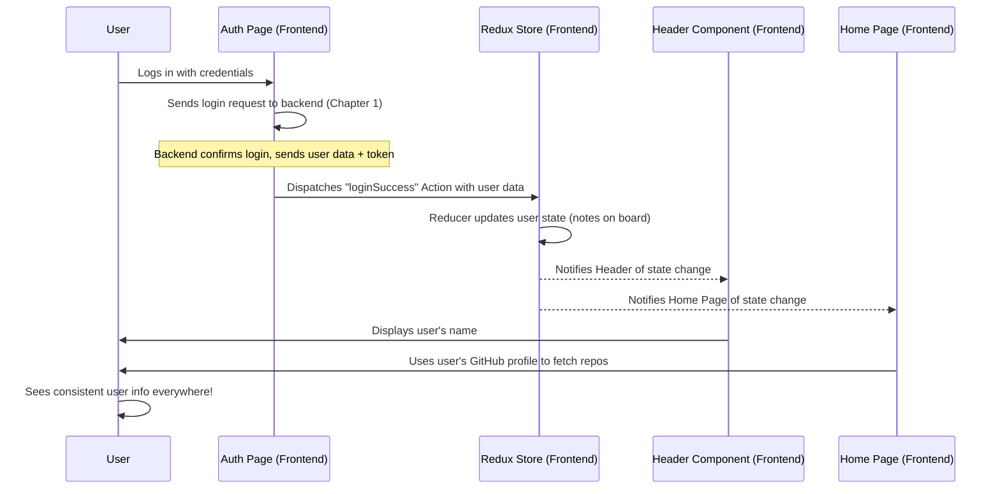

# Chapter 5: Frontend State Management

Welcome back to Vortex! In our previous chapters, especially [Chapter 4: Real-time Build Log Pipeline](04_real_time_build_log_pipeline_.md), we explored how Vortex constantly _receives_ and _displays_ live information. But what about the information that _defines_ the application itself? Things like: "Is the user currently logged in?", "Who is the logged-in user?", or "What's the status of my GitHub integration?"

Imagine Vortex as a busy office building. Each department (a page or a component) needs to know certain key facts. If every department kept its own little notepad with these facts, it would quickly become a mess. If your name changed, you'd have to visit every department to update their notes. Someone might have an old note, leading to confusion!

This is where **Frontend State Management** comes in. It's like having a **central, organized bulletin board** for all the important information in your Vortex application. Instead of each page or component keeping its own notes, they all look at this one shared "memory" called the **store**. When information on this board changes (e.g., you log in or out, or a deployment status updates), all parts of the application that care about that information are automatically updated. This ensures everything you see in Vortex is consistent and up-to-date, providing a smooth and predictable experience.

---

### Your First Step: Knowing Who You Are (Everywhere)

A central use case for Frontend State Management in Vortex is to **keep track of your login status and user details** so that every part of the application can access this information instantly and consistently.

**How it works from your perspective:**

1.  **You Log In:** After successfully logging in ([Chapter 1: User Authentication & Management](01_user_authentication___management_.md)), Vortex needs to remember you.
2.  **Your Header Changes:** The top navigation bar (Header) immediately updates to show your profile icon and name.
3.  **Your Home Page Loads:** When you go to the Home page, it instantly knows your GitHub username to fetch your repositories (thanks to [Chapter 2: GitHub Integration](02_github_integration_.md)).
4.  **You Log Out:** The Header instantly changes back, and you're redirected to the login page.

All these different parts of Vortex (the login page, the header, the home page) need to know the _same_ information about your login status and user details. Frontend State Management makes this easy and reliable.

---

### The Central Bulletin Board: Key Concepts

Vortex uses a popular library called **Redux** to manage its frontend state. Think of Redux as a system with a few important roles:

| Concept             | Analogy                          | What it does in Vortex                                                                                                                     |
| :------------------ | :------------------------------- | :----------------------------------------------------------------------------------------------------------------------------------------- |
| **Store**           | The "Central Bulletin Board"     | The single place where all the important information (state) for your app lives.                                                           |
| **State**           | The "Notes on the Board"         | The actual data stored in the Store (e.g., `user: { name: "Alice" }`, `isLoggedIn: true`).                                                 |
| **Action**          | A "Request to Change a Note"     | A simple message (like "LOGIN*SUCCESS") that describes \_what happened*, but not _how_ to change the state.                                |
| **Reducer**         | The "Rulebook for Notes"         | A special function that takes the current state and an Action, and then _calculates_ the new state. It's the only way to change the Store. |
| **Dispatch**        | "Posting a Request"              | The act of sending an Action to the Store, telling it something happened.                                                                  |
| **Selector**        | "Reading a Specific Note"        | A way for any part of your application to read specific pieces of information from the Store.                                              |
| **`redux-persist`** | "Permanent Ink" or "Sticky Note" | A tool that allows the Store's data to be saved (persisted) even if you close and reopen your browser tab.                                 |

---

### How Vortex Manages User State (Under the Hood)

Let's trace how your login information travels and is managed in Vortex using Redux.



Here's the step-by-step breakdown:

1.  **Login Initiated:** When you successfully log in via the [Auth page](01_user_authentication___management_.md), the `Auth` page receives your user details and a special `token` from the backend.
2.  **Dispatching an Action:** Instead of just updating its own little notes, the `Auth` page `dispatches` a `loginSuccess` action. This action is like a message sent to the central `Redux Store` saying, "Hey, a user just logged in successfully! Here's their data."
3.  **Reducer Updates State:** The `Redux Store` has a "rulebook" (called a `reducer`) specifically for user-related actions. This `reducer` receives the `loginSuccess` action and uses the user data from it to update the `user` and `token` information in the `Store`.
4.  **Components React:** Any component in the application that is "subscribed" to (or `selects`) parts of the `user` state will automatically be notified of this change.
5.  **UI Updates:** Both the `Header` component and the `Home` page (and any other part of Vortex that needs this information) automatically re-render, displaying your name in the header and using your GitHub profile to show repositories, ensuring a consistent experience.
6.  **Logout (Reverse Process):** When you click "Logout" in the Header, a `logout` action is dispatched. The `user` reducer resets the `user` and `token` back to `null`, clearing your information from the `Store`, and the UI updates accordingly.
7.  **Persistence:** Thanks to `redux-persist`, even if you close your browser tab and open Vortex again, it can remember that you were logged in and restore your session using the `token` stored locally.

---

### A Peek at the Code

Let's see the key pieces of code that implement Frontend State Management in Vortex.

#### 1. Setting up the Redux Store (`frontend/src/redux/store.js` & `frontend/src/main.jsx`)

First, we need to create the central "bulletin board" (the Store) and make it available to our entire application.

**`frontend/src/redux/store.js` (The Central Hub)**

```javascript
// frontend/src/redux/store.js (Simplified)
import { configureStore, combineReducers } from "@reduxjs/toolkit";
import userReducer from "./user/UserSlice"; // Our user "notes" rulebook
import storage from "redux-persist/lib/storage";
import { persistStore, persistReducer } from "redux-persist"; // For saving state

const persistConfig = {
	key: "root",
	storage, // Where to save the state (browser's local storage)
	whitelist: ["user"], // Which parts of the state to save (just 'user' for now)
};

// Combine all our "rulebooks" (reducers) into one big rulebook
const rootReducer = combineReducers({
	user: userReducer, // All user-related notes are managed by userReducer
});

// Create a special reducer that also saves/loads state
const persistedReducer = persistReducer(persistConfig, rootReducer);

export const store = configureStore({
	reducer: persistedReducer, // Use our saving reducer here
	// ... default middleware settings ...
});

export const persistor = persistStore(store); // This helps load the saved state
```

_What this code does:_ This file sets up our Redux "Store." It `combineReducers` means we can have different "rulebooks" (like `userReducer`) for different parts of our application's state. Crucially, `persistReducer` wraps our main reducer, telling Redux to automatically save and load the `user` state to and from the browser's local storage (`storage`). This is how Vortex remembers your login!

**`frontend/src/main.jsx` (Connecting the App to the Store)**

```javascript
// frontend/src/main.jsx (Simplified)
import React from "react";
import ReactDOM from "react-dom/client";
import App from "./App.jsx";
import "./index.css";
import { Provider } from "react-redux"; // Connects React to Redux
import { PersistGate } from "redux-persist/integration/react"; // Handles loading saved state
import { store, persistor } from "./redux/store"; // Our configured Redux store

ReactDOM.createRoot(document.getElementById("root")).render(
	<React.StrictMode>
		<Provider store={store}>
			{" "}
			{/* Makes the Redux store available to all components */}
			<PersistGate loading={null} persistor={persistor}>
				{" "}
				{/* Waits for state to load */}
				{/* <AutoLogout /> - Another component, not essential for this explanation */}
				<App /> {/* Our main application component */}
			</PersistGate>
		</Provider>
	</React.StrictMode>
);
```

_What this code does:_ This is the entry point of our React application. The `<Provider store={store}>` component from `react-redux` is essential: it makes our Redux `store` (the central bulletin board) accessible to _every_ component inside the `<App />`. The `<PersistGate>` ensures that our saved state (like your login information) is fully loaded before the app is displayed, preventing flashes or errors.

#### 2. Defining User State and Actions (`frontend/src/redux/user/UserSlice.js`)

This file is the "rulebook" specifically for managing all notes related to the user.

**`frontend/src/redux/user/UserSlice.js` (The User Rulebook)**

```javascript
// frontend/src/redux/user/UserSlice.js (Simplified)
import { createSlice } from "@reduxjs/toolkit";

const initialState = {
	user: null, // Stores user details if logged in (e.g., name, email, githubProfile)
	token: null, // A secret key given after login
	loading: false, // True when login/logout is in progress
	error: null, // Any error messages related to user actions
};

const userSlice = createSlice({
	name: "user", // A unique name for this "rulebook"
	initialState, // The starting notes on the board
	reducers: {
		// When a login attempt starts
		loginStart: (state) => {
			state.loading = true;
			state.error = null;
		},
		// When login is successful (receives data like user and token)
		loginSuccess: (state, action) => {
			state.loading = false;
			state.user = action.payload.user; // Update user details
			state.token = action.payload.token; // Store the secret token
			state.error = null;
		},
		// When login fails
		loginFailure: (state, action) => {
			state.loading = false;
			state.error = action.payload;
		},
		// When user logs out
		logout: (state) => {
			state.user = null; // Clear user details
			state.token = null; // Clear token
			state.loading = false;
			state.error = null;
		},
		// 'logoutSuccess' and 'resetUser' are similar to 'logout' for other scenarios
	},
});

// Export these functions so components can "dispatch" these actions
export const { loginStart, loginSuccess, loginFailure, logout } =
	userSlice.actions;

// Export the reducer so it can be combined in the store
export default userSlice.reducer;
```

_What this code does:_ This `userSlice` defines how all user-related information (the `initialState`) changes in response to `actions`. For example, when `loginSuccess` is "dispatched" (a request is posted), this reducer function updates the `user` and `token` notes on the bulletin board (`state`). When `logout` is dispatched, it clears those notes.

#### 3. Reading State from Components (`frontend/src/components/Header.jsx` & `frontend/src/pages/Home.jsx`)

Now, let's see how different parts of Vortex "read" the notes from the central bulletin board.

**`frontend/src/components/Header.jsx` (Displaying User Info and Logout Button)**

```javascript
// frontend/src/components/Header.jsx (Simplified)
import React, { useRef, useState, useEffect } from "react";
import { Link, useNavigate } from "react-router-dom";
import { useDispatch, useSelector } from "react-redux"; // New imports!
import { logout } from "../redux/user/UserSlice"; // Our logout action

const Header = () => {
	// Read the 'user' object from the Redux store
	const { user } = useSelector((state) => state.user); // Selects the 'user' note

	const dispatch = useDispatch(); // Get the "dispatcher" tool
	const navigate = useNavigate();

	const handleLogout = () => {
		dispatch(logout()); // Post the "logout" request to the store
		navigate("/"); // Go back to the homepage
	};

	return (
		<header className="bg-[#0d0d0d] px-6 py-4 relative z-50">
			{/* ... other header content ... */}

			{user ? ( // If 'user' exists in the state (meaning logged in)
				<div className="relative">
					{/* ... display user icon and dropdown menu ... */}
					<button onClick={handleLogout} className="mt-4 bg-gray-900 ...">
						Logout
					</button>
				</div>
			) : (
				<Link to="/auth" className="text-white hover:text-gray-400">
					Sign In
				</Link>
			)}
		</header>
	);
};

export default Header;
```

_What this code does:_ The `useSelector` hook is very important here. It allows the `Header` component to directly "read a specific note" (the `user` object) from the Redux `store`. If `user` exists (meaning you're logged in), it displays your details and a Logout button. When the logout button is clicked, `useDispatch` is used to "post a request" by calling `dispatch(logout())`. This sends the `logout` action to the Red Reducer, clearing your session.

**`frontend/src/pages/Home.jsx` (Using User's GitHub Profile)**

```javascript
// frontend/src/pages/Home.jsx (Simplified snippet)
import React, { useState, useEffect } from "react";
import { useSelector } from "react-redux"; // New import!
import axios from "axios";

const Home = () => {
	const [repositories, setRepositories] = useState([]);
	// Read the 'user' object from the Redux store
	const { user } = useSelector((state) => state.user);
	const username = user?.githubProfile; // Get GitHub profile from the user object

	useEffect(() => {
		const fetchReposAndDeployments = async () => {
			if (!username) return; // Don't fetch if no GitHub profile is set
			try {
				// Use the username from Redux state to fetch repositories
				const reposResponse = await axios.post("/api/github/repos", {
					githubProfile: username,
				});
				setRepositories(reposResponse.data);
				// ... logic to check deployment status for each repo ...
			} catch (error) {
				console.error("Error fetching repositories:", error);
			}
		};

		fetchReposAndDeployments();
	}, [username]); // Re-run this effect if the username from state changes

	// ... rest of the component for displaying repositories ...
};

export default Home;
```

_What this code does:_ Similar to the `Header`, the `Home` page also uses `useSelector` to read the `user` object from the Redux store. It specifically extracts the `githubProfile` (`username`) from it. This `username` is then used in the `useEffect` hook to make an API call to the backend ([Chapter 2: GitHub Integration](02_github_integration_.md)) to fetch your GitHub repositories. This demonstrates how data stored in Redux can be accessed and used across different, unrelated components.

---

### Conclusion

In this chapter, we've explored **Frontend State Management** in Vortex, understanding how it acts as the "central nervous system" or a "central bulletin board" for your application's data. You've learned how Redux, with its concepts of Store, Actions, and Reducers, ensures that critical information like your user details and login status are consistently managed and accessible across the entire application. We saw how `redux-persist` helps Vortex remember your session even after you close the browser, providing a seamless user experience.

This robust state management system is fundamental to building complex, interactive applications like Vortex, ensuring all parts of the user interface remain synchronized and accurate.

[Next Chapter: Service Orchestration](06_service_orchestration_.md)

---

<sub><sup>**References**: [[1]](https://github.com/rohithr018/Vortex/blob/a4e90cde639281d2a87d34304364bab9c7af8969/frontend/src/components/Header.jsx), [[2]](https://github.com/rohithr018/Vortex/blob/a4e90cde639281d2a87d34304364bab9c7af8969/frontend/src/main.jsx), [[3]](https://github.com/rohithr018/Vortex/blob/a4e90cde639281d2a87d34304364bab9c7af8969/frontend/src/pages/Home.jsx), [[4]](https://github.com/rohithr018/Vortex/blob/a4e90cde639281d2a87d34304364bab9c7af8969/frontend/src/redux/store.js), [[5]](https://github.com/rohithr018/Vortex/blob/a4e90cde639281d2a87d34304364bab9c7af8969/frontend/src/redux/user/UserSlice.js)</sup></sub>
