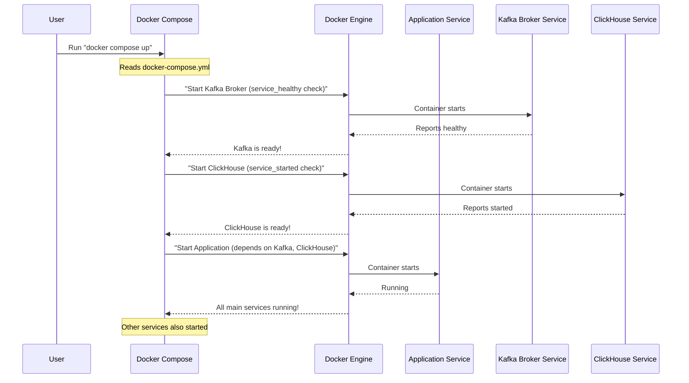

# Chapter 6: Service Orchestration

Welcome back! In our previous chapters, we've explored different vital parts of Vortex. In [Chapter 5: Frontend State Management](05_frontend_state_management_.md), we learned how the _frontend_ keeps track of important information. But Vortex is made up of many different services working together: the frontend, the backend, databases, a logging system (Kafka and ClickHouse), and even temporary build servers. How do all these individual pieces start up, find each other, and work as one unified platform?

Imagine you're assembling a complex robot, but all its parts (arms, legs, head, battery) are separate. You can't just throw them together and expect them to work! You need a **master plan** that tells each part:

- "Where do I plug in?"
- "Who do I talk to?"
- "What do I need to start working?"
- "Do I need to wait for another part to be ready first?"

This "master plan" for getting all the different parts of Vortex to work together as a single, powerful application is called **Service Orchestration**. In Vortex, a special tool called **Docker Compose** acts as the conductor, reading a detailed script (named `docker-compose.yml`) that brings everything to life in harmony.

---

### Your First Step: Starting Up Vortex

The central use case for Service Orchestration is simply **starting the entire Vortex platform and ensuring all its components are running correctly and can communicate with each other.**

**How it works from your perspective (the user):**

1.  **Open your Terminal:** You open a command-line window on your computer.
2.  **Navigate to the Vortex Project:** You go to the main folder where Vortex's files are located.
3.  **Run the Magic Command:** You type `docker compose up` and press Enter.
4.  **Watch Vortex Come Alive:** Docker Compose takes over, and you'll see messages indicating that various services (like `vortex-app`, `kafka-broker`, `clickhouse`) are starting up, one by one.
5.  **Access Vortex:** After a short while, you can open your web browser and go to `localhost:3000`, and the Vortex application is ready to use!

Without **Service Orchestration**, you would have to manually start each part of Vortex separately, remember complex settings for each, and ensure they connect correctly – a nightmare for anyone! Docker Compose automates all of this.

---

### The Conductor and the Sheet Music: Key Concepts

Vortex uses **Docker Compose** and a file named `docker-compose.yml` for its Service Orchestration. Let's break down these key ideas:

| Concept                  | Analogy                                                          | What it does in Vortex                                                                                                                                                                  |
| :----------------------- | :--------------------------------------------------------------- | :-------------------------------------------------------------------------------------------------------------------------------------------------------------------------------------- |
| **Service**              | An individual musician in a band (e.g., the drummer, the singer) | A single, independent part of Vortex (e.g., the `application` backend, the `kafka-broker` for logs, `clickhouse` for the database). Each runs in its own isolated **Docker Container**. |
| **Orchestration**        | The conductor arranging all the musicians to play together       | The process of defining, starting, linking, and managing all the different **services** so they work as one unified system.                                                             |
| **Docker Compose**       | The "Conductor" of the band                                      | A tool that reads the `docker-compose.yml` file and automatically sets up and runs all the defined services. It ensures they start in the right order and can talk to each other.       |
| **`docker-compose.yml`** | The "Sheet Music" or "Master Plan" for the band                  | A text file (in YAML format) that lists all the services, how they should be built or started, what resources they need (like ports), and how they should connect to each other.        |

---

### How Vortex Gets Orchestrated (Under the Hood)

Let's see the simplified flow of how Docker Compose brings all of Vortex's services to life when you run `docker compose up`.



Here's what happens step-by-step:

1.  **You Run the Command:** When you type `docker compose up`, you tell the `Docker Compose` tool to start all the services defined in your `docker-compose.yml` file.
2.  **Docker Compose Reads the Plan:** Docker Compose immediately reads the `docker-compose.yml` file, which contains the entire blueprint for your Vortex application.
3.  **It Finds Services and Dependencies:** It sees a list of services (like `kafka-broker`, `clickhouse`, `application`, etc.). Importantly, it also notices `depends_on` instructions for some services. For example, the `application` (Vortex backend) needs `kafka-broker` and `clickhouse` to be up and ready _before_ it can start properly.
4.  **Orderly Startup:** Docker Compose ensures services start in the correct order. It first starts `kafka-broker`, then `clickhouse` (because `application` depends on them). It waits for them to signal they are "healthy" or "started."
5.  **Each Service Gets its Container:** For each service, Docker Compose tells the underlying `Docker Engine` to create and run a separate, isolated "container." These containers are like small, self-contained packages that have everything a service needs to run.
6.  **Connections are Made:** Docker Compose also sets up special internal `networks` so these containers can talk to each other by their names (e.g., `application` can talk to `kafka-broker` using that name, not a complex IP address).
7.  **External Access:** It also maps `ports` so you can access services like the Vortex frontend (`3000:3000`) or backend (`5000:5000`) from your web browser.
8.  **Vortex is Ready!** Once all services are up and connected according to the plan, your entire Vortex platform is operational.

---

### A Peek at the Code: The `docker-compose.yml` Master Plan

The entire magic of Service Orchestration in Vortex happens within the `services/docker-compose.yml` file. Let's look at key parts of this "sheet music."

#### 1. The Overall Structure and Services

The `docker-compose.yml` file defines all the individual parts (services) of our application.

**`services/docker-compose.yml` (Overall Structure Snippet)**

```yaml
# services/docker-compose.yml (Simplified)
version: "3.8" # The format version for Docker Compose

services: # This section lists all the individual parts of Vortex
  kafka-controller:# A service for managing Kafka
    # ... configuration for kafka-controller ...

  kafka-broker:# Our high-speed messenger service (from Chapter 4)
    # ... configuration for kafka-broker ...

  topic-init:# Ensures Kafka topics exist
    # ... configuration for topic-init ...

  console:# A tool to view Kafka messages (optional)
    # ... configuration for console ...

  clickhouse:# Our super-fast log book (from Chapter 4)
    # ... configuration for clickhouse ...

  application:# This is the Vortex backend (the main brain)
    # ... configuration for application ...
# ... Other top-level sections for volumes and networks ...
```

_What this code does:_ This shows the basic outline. The `version` tells Docker Compose how to interpret the file. The `services:` section is where we define _each_ independent component of Vortex, like our `kafka-broker` (the message bus for logs), `clickhouse` (the log database), and `application` (the Vortex backend itself). Each service gets its own set of instructions.

#### 2. Defining a Service: The `application` Backend Example

Let's zoom in on how the main `application` (Vortex backend) service is defined.

**`services/docker-compose.yml` (Application Service Snippet)**

```yaml
# services/docker-compose.yml (Application Service - Simplified)
application:
  image: rohith1809/vortex:latest # 1. What software image to use
  container_name: vortex-app # 2. A friendly name for its container
  depends_on: # 3. What services it needs to wait for
    kafka-broker:
      condition: service_healthy #  - Kafka must be healthy
    clickhouse:
      condition: service_started #  - ClickHouse must be started
  ports: # 4. How to access it from outside
    - "3000:3000" # Frontend port (Vortex UI)
    - "5000:5000" # Backend API port (where frontend talks to backend)
  volumes: # 5. Connect host files/folders (important for Chapter 3)
    - /var/run/docker.sock:/var/run/docker.sock # Allows backend to control Docker
  networks: # 6. Which internal networks it's part of
    - deployment
  restart: unless-stopped # 7. Always restart if it crashes, unless manually stopped
  environment: # 8. Special settings (environment variables)
    - DOCKER_HOST=unix:///var/run/docker.sock # Tells backend where Docker is
```

_What this code does:_

1.  `image: rohith1809/vortex:latest`: This tells Docker Compose to use a pre-built Docker image called `rohith1809/vortex` (which contains our backend and frontend code).
2.  `container_name: vortex-app`: This gives a specific, easy-to-remember name to the running container, so it's easier to find later.
3.  `depends_on`: This is a crucial orchestration instruction! It tells Docker Compose: "Don't start the `application` until `kafka-broker` is `healthy` and `clickhouse` has `started`." This prevents errors where the backend tries to connect to a service that isn't ready yet.
4.  `ports`: This maps network ports. `3000:3000` means if you visit `localhost:3000` on your computer, you'll be directed to port `3000` inside the `vortex-app` container (where the frontend runs). `5000:5000` is for the backend API.
5.  `volumes: - /var/run/docker.sock:/var/run/docker.sock`: This is a special instruction! It essentially gives the `application` container direct control over your computer's Docker Engine. This is what allows our Vortex backend to _start new build server containers_ for your deployments ([as seen in Chapter 3: Project Deployment Lifecycle](03_project_deployment_lifecycle.md)).
6.  `networks: - deployment`: This assigns the `application` service to a custom network named `deployment`. All services in this network can communicate with each other using their service names (e.g., `application` can talk to `kafka-broker` directly).
7.  `restart: unless-stopped`: If the `vortex-app` container ever crashes or stops unexpectedly, Docker Compose will try to restart it automatically, keeping Vortex running.
8.  `environment: - DOCKER_HOST=unix:///var/run/docker.sock`: This passes a setting _into_ the container, telling the Vortex backend where to find the Docker socket it needs to control Docker.

#### 3. Defining Internal Networks

For services to talk to each other without needing complicated IP addresses, Docker Compose sets up custom networks.

**`services/docker-compose.yml` (Networks Snippet)**

```yaml
# services/docker-compose.yml (Networks Section)
# ... services definitions above ...

networks:
  deployment: # This defines a custom network named 'deployment'
    name: deployment # Explicitly names the Docker network
    driver: bridge # Uses a common type of network (bridge)
```

_What this code does:_ This `networks` section at the very bottom of the `docker-compose.yml` file defines a custom network called `deployment`. All the services that are part of this network (like `application`, `kafka-broker`, `clickhouse`, etc., as specified by `networks: - deployment` within each service) can communicate with each other securely and easily using their defined service names.

---

### Conclusion

In this chapter, we've uncovered the essential role of **Service Orchestration** in Vortex. You've learned how **Docker Compose**, acting as the conductor, reads the **`docker-compose.yml`** "master plan" to seamlessly bring together all the different components of Vortex – the frontend, backend, databases, and build servers – into one harmonious and functional application. We explored how Docker Compose handles dependencies, port mapping, internal networking, and even grants special permissions (like controlling other Docker containers for deployments!), ensuring that when you run `docker compose up`, everything comes alive perfectly.

Understanding Service Orchestration is key to knowing how the entire Vortex platform operates as a single, unified system. Next, we'll delve into how Vortex ensures your important data (like user accounts and deployment history) is never lost, even if containers are restarted, in **Persistent Data Storage**!

[Next Chapter: Persistent Data Storage](07_persistent_data_storage_.md)

---

<sub><sup>**References**: [[1]](https://github.com/rohithr018/Vortex/blob/a4e90cde639281d2a87d34304364bab9c7af8969/Dockerfile), [[2]](https://github.com/rohithr018/Vortex/blob/a4e90cde639281d2a87d34304364bab9c7af8969/build-server/Dockerfile), [[3]](https://github.com/rohithr018/Vortex/blob/a4e90cde639281d2a87d34304364bab9c7af8969/services/docker-compose.yml)</sup></sub>
