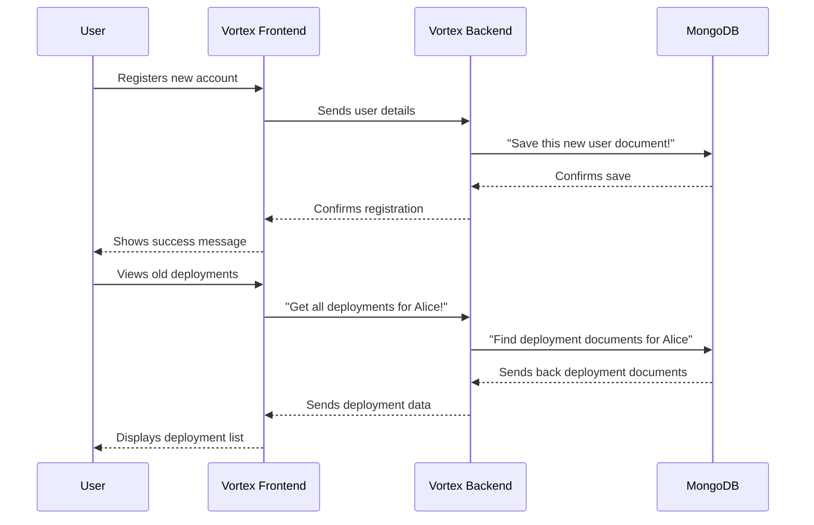

# Chapter 7: Persistent Data Storage

Welcome back! In our previous chapter, [Chapter 6: Service Orchestration](06_service_orchestration_.md), we learned how Vortex uses Docker Compose to magically bring all its different parts (like the frontend, backend, and build servers) to life and make them work together. You type one command, and the whole system starts running!

But imagine what would happen if you restarted your computer, or if Vortex's services needed to stop and start again. Would all your user accounts disappear? Would your project deployment history vanish? That would be a huge problem!

This is where **Persistent Data Storage** comes in. Think of it as the **long-term memory** of the Vortex platform. It's where all the crucial information – like user accounts, their login times, and detailed records of every project you've ever deployed (including their unique web addresses!) – is securely saved. This means that even if Vortex's services restart or your computer shuts down, all your important data will still be there, safe and sound, just waiting for Vortex to pick up exactly where it left off.

---

### Your First Step: Keeping Your Data Safe

The central idea of Persistent Data Storage is to **ensure that all important information created or used within Vortex is saved permanently and is available whenever you need it, even after restarts.**

**How it works from your perspective:**

1.  **You Register:** When you create an account on Vortex ([from Chapter 1](01_user_authentication___management_.md)), your username, email, password (in a secret form!), and GitHub profile are all saved.
2.  **You Log In Later:** When you come back another day and log in, Vortex remembers you because your data was saved.
3.  **You Deploy a Project:** When you successfully deploy a project ([from Chapter 3](03_project_deployment_lifecycle.md)), Vortex records all the details: the project's name, the branch you deployed, when it was deployed, and most importantly, the live web address (URL) where your project can be viewed.
4.  **You See Your History:** You can always go back and see a list of all your past deployments, click on their URLs, and access your projects.

This "memory" is what makes Vortex truly useful and reliable.

---

### The Digital Filing Cabinet: Key Concepts

Vortex uses a database called **MongoDB** for its persistent data storage. Imagine MongoDB as a highly organized digital filing cabinet, optimized for quickly storing and retrieving information.

| Concept        | Analogy                                                                                 | What it does in Vortex                                                                    |
| :------------- | :-------------------------------------------------------------------------------------- | :---------------------------------------------------------------------------------------- |
| **Database**   | The entire "Digital Filing Cabinet"                                                     | The main system (MongoDB) where all the data is stored.                                   |
| **Collection** | A "Specific Drawer" in the cabinet (e.g., "User Accounts," "Project Deployments")       | A grouping of related data records. Vortex has collections for `users` and `deployments`. |
| **Document**   | A "Single File" within a drawer (e.g., "Alice's Account," "My Blog Project Deployment") | A single record of information. In MongoDB, these are like flexible JSON objects.         |

---

### How Vortex Remembers (Under the Hood)

Let's see how Vortex interacts with its long-term memory (MongoDB) to save and retrieve your data.



Here's a step-by-step breakdown:

1.  **Request to Save/Retrieve:** When you perform an action that needs data saved (like registering) or retrieved (like viewing deployments), your `Vortex Frontend` sends a request to the `Vortex Backend`.
2.  **Backend Processes Request:** The `Vortex Backend` receives this request. It knows which "collection" (drawer) to access and what "document" (file) to save or find.
3.  **Backend Talks to MongoDB:** Using specific commands, the `Vortex Backend` communicates with `MongoDB`.
    - To save: It sends a new "document" with your information to the correct "collection."
    - To retrieve: It asks `MongoDB` to find specific "documents" based on criteria (e.g., "all deployments by this username").
4.  **MongoDB Responds:** `MongoDB` performs the operation and sends a confirmation (for saves) or the requested data (for retrievals) back to the `Vortex Backend`.
5.  **Data Sent to Frontend:** The `Vortex Backend` then sends this information back to the `Vortex Frontend`, which updates what you see on your screen.

This entire process ensures that your data is securely stored and readily available whenever Vortex needs it.

---

### A Peek at the Code

Let's look at the key parts of Vortex's code that make this persistent storage work.

#### 1. Connecting to the Database (`backend/server.js`)

The `server.js` file is where the Vortex backend first starts up and establishes its connection to the MongoDB database.

```javascript
// backend/server.js (Simplified)
import mongoose from "mongoose"; // Library to talk to MongoDB
import dotenv from "dotenv";
// ... other imports ...

dotenv.config(); // Loads environment variables, including MONGO_URI

const app = express();
// ... middleware and routes ...

// MongoDB Connection
mongoose
	.connect(process.env.MONGO_URI) // Connect using the database address
	.then(() => {
		console.log("MongoDB connected");
		// Start the server only after successful connection
		app.listen(process.env.PORT || 5000, () => {
			console.log(`Server running on port ${process.env.PORT || 5000}`);
		});
	})
	.catch((err) => {
		console.error("MongoDB connection error:", err);
		process.exit(1); // Exit if connection fails
	});
```

_What this code does:_ This snippet shows the most crucial part: `mongoose.connect(process.env.MONGO_URI)`. `mongoose` is a special tool that makes it easy for our Node.js backend to talk to MongoDB. `process.env.MONGO_URI` is the secret address of our MongoDB database (usually provided by [Service Orchestration](06_service_orchestration_.md) or environment settings). Vortex only starts listening for requests once it has successfully connected to its database, ensuring it's ready to save or retrieve data.

#### 2. Defining Data Blueprints (`backend/models/user.model.js` & `backend/models/deployment.model.js`)

Before saving any data, Vortex needs to know what kind of information each "document" (record) will hold. These are like blueprints for the data.

**`backend/models/user.model.js` (User Blueprint)**

```javascript
// backend/models/user.model.js
import mongoose from "mongoose";

const userSchema = new mongoose.Schema( // Define the structure for a 'User'
	{
		username: { type: String, required: true, unique: true }, // Must have, must be unique
		fullname: { type: String, required: true },
		email: { type: String, required: true, unique: true },
		githubProfile: { type: String, required: true },
		password: { type: String }, // Stored as a hash, not plain text for security
	},
	{ timestamps: true } // Automatically add 'createdAt' and 'updatedAt' dates
);

export default mongoose.model("User", userSchema); // Create the 'User' model (collection)
```

_What this code does:_ This `userSchema` is the blueprint for how a user's data will look in the database. It says that every user document must have a `username`, `fullname`, `email`, `githubProfile`, and `password`. The `unique: true` part tells MongoDB not to allow two users with the same username or email. `timestamps: true` is a handy feature that automatically adds fields to track when a user record was created and last updated. When `mongoose.model('User', userSchema)` runs, it tells MongoDB to create (or use) a "collection" named `users` (plural of 'User') to store these documents.

**`backend/models/deployment.model.js` (Deployment Blueprint)**

```javascript
// backend/models/deployment.model.js
import mongoose from "mongoose";

const deploymentSchema = new mongoose.Schema( // Define structure for a 'Deployment'
	{
		deploymentId: { type: String, required: true, unique: true }, // Unique ID for each deployment
		repoName: { type: String, required: true },
		branch: { type: String, required: true },
		username: { type: String, required: true },
		logs: [
			// Can store a list of log entries (though real-time logs use ClickHouse)
			{
				message: String,
				level: String,
				timestamp: Date,
			},
		],
		url: { type: String, required: true }, // The live URL of the deployed project
	},
	{ timestamps: true }
);

export default mongoose.model("Deployment", deploymentSchema); // Create the 'Deployment' model
```

_What this code does:_ Similar to `userSchema`, this `deploymentSchema` defines the structure for storing information about each project deployment. It ensures that every deployment record has a unique `deploymentId`, the repository name, branch, username, a place for logs (for historical reference, although live logs are handled by [Chapter 4: Real-time Build Log Pipeline](04_real_time_build_log_pipeline_.md)), and the most important part: the `url` of the live project. This creates a `deployments` collection in MongoDB.

#### 3. Saving and Retrieving Data (Backend Controllers)

These are the "workers" on the backend that take data from the frontend and either save it to MongoDB or fetch it from MongoDB.

**`backend/controllers/user.controller.js` (Updating User Data)**

```javascript
// backend/controllers/user.controller.js (Simplified: updateUser)
import User from "../models/user.model.js"; // Our User blueprint

export const updateUser = async (req, res) => {
	const { username } = req.params; // Get username from URL
	const { fullname, email, password } = req.body; // Get updated info from request

	try {
		const user = await User.findOne({ username }); // Find user in MongoDB
		if (!user) return res.status(404).json({ message: "User not found" });

		// Update fields if provided
		if (fullname) user.fullname = fullname;
		if (email) user.email = email;
		if (password && password.trim() !== "") {
			// Hash new password before saving (security!)
			user.password = await bcrypt.hash(password, 10);
		}

		const updatedUser = await user.save(); // Save changes to MongoDB!
		res
			.status(200)
			.json({ message: "User updated successfully", user: updatedUser });
	} catch (err) {
		console.error(err);
		res.status(500).json({ message: "Server error" });
	}
};
```

_What this code does:_ The `updateUser` function first uses `User.findOne({ username })` to search for an existing user record in the `users` collection in MongoDB. If found, it updates the user's details. The `await user.save()` line is the key: this command tells Mongoose to send these updated changes to MongoDB and permanently store them. (A similar `user.save()` is used when a new user registers in `auth.controller.js`).

**`backend/controllers/deploy.controller.js` (Creating and Retrieving Deployment Records)**

```javascript
// backend/controllers/deploy.controller.js (Simplified: createDeployment)
import Deployment from "../models/deployment.model.js"; // Our Deployment blueprint

export const createDeployment = async (req, res) => {
	try {
		const { deploymentId, repoName, branch, username, logs, url } = req.body;

		// Check if a deployment with this ID already exists
		const existingDeployment = await Deployment.findOne({ deploymentId });

		if (existingDeployment) {
			// If it exists, update it (e.g., if re-deploying or adding final details)
			existingDeployment.repoName = repoName;
			existingDeployment.branch = branch;
			existingDeployment.username = username;
			existingDeployment.logs = logs || [];
			existingDeployment.url = url;
			await existingDeployment.save(); // Save the updated record
			return res.status(200).json({
				message: "Deployment updated successfully",
				deployment: existingDeployment,
			});
		} else {
			// If it's a new deployment, create a new record
			const newDeployment = new Deployment({
				deploymentId,
				repoName,
				branch,
				username,
				logs: logs || [],
				url,
			});
			await newDeployment.save(); // Save the new record to MongoDB!
			return res.status(201).json({
				message: "Deployment created successfully",
				deployment: newDeployment,
			});
		}
	} catch (error) {
		console.error("Error creating deployment:", error);
		res.status(500).json({ message: "Server error" });
	}
};

// backend/controllers/deploy.controller.js (Simplified: getDeploymentsByUser)
export const getDeploymentsByUser = async (req, res) => {
	try {
		const { user } = req.query; // Get username from query parameters

		if (!user) {
			return res.status(400).json({ message: "User parameter is required" });
		}

		// Find all deployment documents for a specific username
		const deployments = await Deployment.find({ username: user }); // Retrieve from MongoDB
		res.status(200).json(deployments); // Send the list back to frontend
	} catch (err) {
		console.error("Error fetching deployments:", err);
		res.status(500).json({ message: "Server error" });
	}
};
```

_What this code does:_

- The `createDeployment` function is responsible for saving a new deployment record (or updating an existing one if a redeployment happens). It creates a new `Deployment` object using our blueprint and then calls `await newDeployment.save()` to store it in the `deployments` collection in MongoDB.
- The `getDeploymentsByUser` function demonstrates _retrieving_ data. When you want to see all your past projects, this function uses `await Deployment.find({ username: user })` to ask MongoDB for all documents in the `deployments` collection where the `username` matches the current logged-in user. The retrieved list is then sent back to the frontend to be displayed.

---

### Conclusion

In this final chapter, we've explored the crucial concept of **Persistent Data Storage** in Vortex. You've learned how MongoDB acts as the "long-term memory" or "digital filing cabinet" for the entire platform, securely saving all your important data like user accounts and detailed deployment history. We looked at how the backend connects to MongoDB, defines the structure of the data using "blueprints," and then saves or retrieves records to ensure your information is always available, even after restarts.

This persistent storage is the backbone of Vortex's reliability, ensuring that all your hard work and project history are never lost, providing a consistent and robust experience for every user.

---

<sub><sup>**References**: [[1]](https://github.com/rohithr018/Vortex/blob/a4e90cde639281d2a87d34304364bab9c7af8969/backend/controllers/deploy.controller.js), [[2]](https://github.com/rohithr018/Vortex/blob/a4e90cde639281d2a87d34304364bab9c7af8969/backend/controllers/user.controller.js), [[3]](https://github.com/rohithr018/Vortex/blob/a4e90cde639281d2a87d34304364bab9c7af8969/backend/models/deployment.model.js), [[4]](https://github.com/rohithr018/Vortex/blob/a4e90cde639281d2a87d34304364bab9c7af8969/backend/models/user.model.js), [[5]](https://github.com/rohithr018/Vortex/blob/a4e90cde639281d2a87d34304364bab9c7af8969/backend/server.js)</sup></sub>
