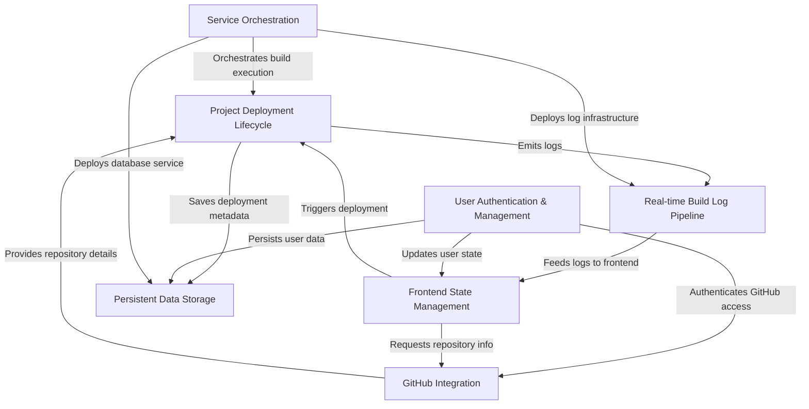

# Tutorial: Vortex

**Vortex** is an _automated deployment platform_ designed to simplify taking a user's **GitHub code** and publishing it as a live website. It acts like a personal, automated build engineer, handling everything from _fetching your project_ from GitHub and **building it** in an isolated environment, to _uploading the final static files_ for hosting, all while providing **real-time logs** for transparent progress tracking.

## Visual Overview

## Chapters

1. [User Authentication & Management
   ](01_user_authentication___management_.md)
2. [GitHub Integration
   ](02_github_integration_.md)
3. [Project Deployment Lifecycle
   ](03_project_deployment_lifecycle_.md)
4. [Real-time Build Log Pipeline
   ](04_real_time_build_log_pipeline_.md)
5. [Frontend State Management
   ](05_frontend_state_management_.md)
6. [Service Orchestration
   ](06_service_orchestration_.md)
7. [Persistent Data Storage
   ](07_persistent_data_storage_.md)

---
